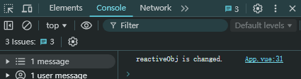

# watch传入的源reactive和ref的区别
在使用监听器的过程中，发现传入的源数据类型为`Reactive对象`和`Ref对象`时，有差异现象。

```vue
<template>
  <button @click="changeObj">change obj</button>
</template>

<script setup>
import { ref, reactive, watch } from 'vue'

const reactiveObj = reactive({
  count: 0,
  child: {
    child: {
      count: Math.random(),
    }
  }
})
const refObj = ref({
  child: {
    child: {
      count: Math.random(),
    }
  }
})

const changeObj = () => {
  reactiveObj.child.child.count = Math.random()
  refObj.value.child.child.count = Math.random()
}

watch(reactiveObj, () => {
  console.log('reactiveObj is changed.')
})
watch(refObj, () => {
  console.log('refObj is changed.')
})
    
</script>
```

`refObj`和`reactiveObj`给了两个相同的数据结构；当同时监听这俩对象时，改变深层属性`count`，按上面的写法，只有`reactiveObj`触发了改变。




如果想要`refObj`被监听，有两种方法可以实现：

**方法一**

```js
watch(refObj, () => {
  console.log('refObj is changed.')
}, {
    deep: true
})
```

**方法二**

```js
watch(refObj.value, () => {
  console.log('refObj is changed.')
})
```


细品....