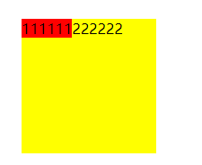
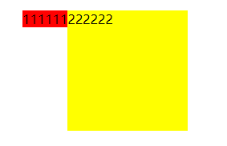
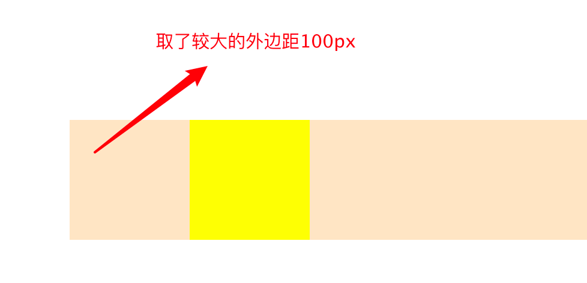
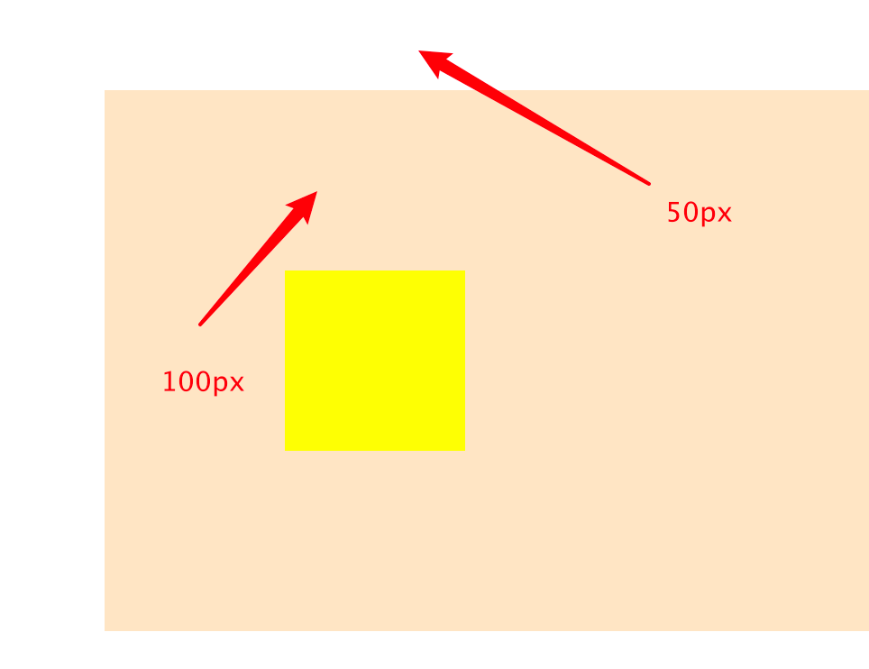
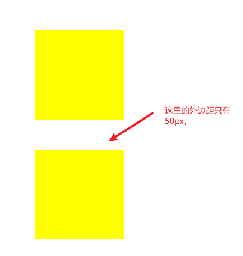
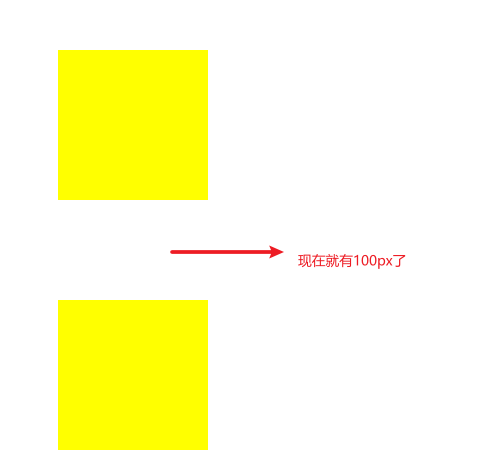

# 什么是BFC？如何理解？

## BFC是什么?

Block Formatting Context

BFC是一个隔离区域，这个区域中的子元素不会影响到外部的环境。

这个区域会有一些特性：

- 子元素垂直方向的外边距会重叠，但不会与外部元素重叠；
- 高度是包含内部的浮动元素的，同时也会排除外部的浮动元素

## 如何创建BFC?

要创建一个BFC有很多种方式了，

例如：

- 根元素本身就是一个BFC区域；
- 浮动元素float不为none；
- 定位元素position定义为absolute、fixed；
- overflow不为visible、clip，比如auto、hidden；
- display定义成inline-block、table、table-cell、flow-root、flex、grid等等。

> 我觉得在不需要使用到特定属性的时候，最好直接使用display:flow-root，它可以创建一个无副作用的BFC。避免加上了一些特殊的属性，其他人看代码的时候会有疑惑，要不就是加上注释解释一下吧。

## 利用BFC的特性，可以解决CSS在某些场景下的一些常见的问题。

### 高度坍塌的问题

这个通常是容器中的子元素都是浮动元素造成的，浮动元素不占据父容器的高度，使得父容器的高度为0。

针对这个问题，可以利用BFC的特性来解决：BFC会包含其内部浮动的元素。

要给父容器创建一个BFC区域，可以用上刚刚提到的一些方式。

```html
<div class="container">
  <div class="box"></div>
  <div class="box"></div>
</div>
<style>
  .container {
    background-color: #000;
    display: flow-root;/* 直接在父容器加上此属性即可（或者float:left之类的都是可以的） */
  }
  .box {
    width: 100px;
    height: 100px;
    background-color: red;
    float: left;
  }
</style>
```

另外，要解决高度坍塌，还可以用一个比较经典的方法，clearfix，即通过给父元素添加::after伪类，这个伪类加上

```html
<div class="container">
  <div class="box"></div>
  <div class="box"></div>
</div>
<style>
  .container {
    background-color: #000;
  }
  .container::after {
    content: '';
    display: block;
    clear: both;
  }
  .box {
    width: 100px;
    height: 100px;
    background-color: red;
    float: left;
  }
</style>
```


### 排查外部浮动的特性

这个是针对两个box，第一个box如果设置了浮动，第二个box会与第一个box重叠。



如果希望第二个box不要与第一个box重叠，可以给第二个box创建一个BFC，这也就是利用BFC排查外部浮动的特性。

```html
<div class="container">
  <div class="float">111111</div>
  <div class="box" style="display: flow-root;">222222</div>
</div>
<style>
  .container {
    margin: 100px;
  }
  .box {
    width: 150px;
    height: 150px;
    background-color: yellow;
  }
  .float {
    float: left;
    background-color: red;

  }
</style>
```



### 防止外边距的重叠

外边距重叠主要是CSS布局模型设计上的一个特性，在垂直外边距上会重叠，取比较大的一个作为实际外边距。可能会在相邻的兄弟元素或者父子元素。

针对父子元素：



这个问题可以利用BFC来解决

```html
<div class="container">
  <div class="box"></div>
</div>
<style>
  .container {
    background-color: bisque;
    margin: 50px;
    display: flow-root;
  }
  .box {
    margin: 100px;
    width: 100px;
    height: 100px;
    background-color: yellow;
  }
</style>
```



这回就是各管各的外边距了，加起来就有150px了。

另外，要解决这个问题，不仅可以通过BFC，也可以通过给父容器加边框来解决

```html
<div class="container">
  <div class="box"></div>
</div>
<style>
  .container {
    margin: 50px;
    border: 1px solid transparent;
  }
  .box {
    margin: 100px;
    width: 100px;
    height: 100px;
    background-color: yellow;
  }
</style>
```

但这会带来一些副作用：高度增加。


针对相邻兄弟元素：

```html
<div class="box"></div>
<div class="box"></div>
<style>
  .box {
    margin: 50px;
    width: 150px;
    height: 150px;
    background-color: yellow;
  }
</style>
```



要解决这个问题，需要创建一个BFC容器，把其中一个元素包裹起来。

```html
<div class="box"></div>
<div class="outer">
  <div class="box"></div>
</div>
<style>
  .box {
    margin: 50px;
    width: 150px;
    height: 150px;
    background-color: yellow;
  }
  .outer {
    display: flow-root;
  }
</style>
```



或者可以在中间加一个BFC

```html
<div class="box"></div>
<div class="bfc"></div>
<div class="box"></div>
<style>
  .box {
    margin: 50px;
    width: 150px;
    height: 150px;
    background-color: yellow;
  }
  .bfc {
    overflow: hidden;
  }
</style>
```


## 面试回答内容：

1. 什么是`BFC`？

   BFC是一个隔离的盒子，盒子内部的元素不会影响到外部的环境。

2. 有什么特性

   - 盒子高度会包含浮动元素的高度
   - BFC会排除外部的浮动元素
   - 垂直方向的外边距不会重叠

3. 如何创建一个`BFC`？

   - 根元素本身就是一个BFC
   - display：flex、grid、table、inline-block、flow-root
   - position：absolute、fixed
   - overflow：auto、hidden

4. 有什么实际场景？如何解决相应问题

   - 高度坍塌
   - 排除外部浮动元素
   - 垂直方向的margin重合
     - 父子元素的情况
     - 兄弟元素的情况