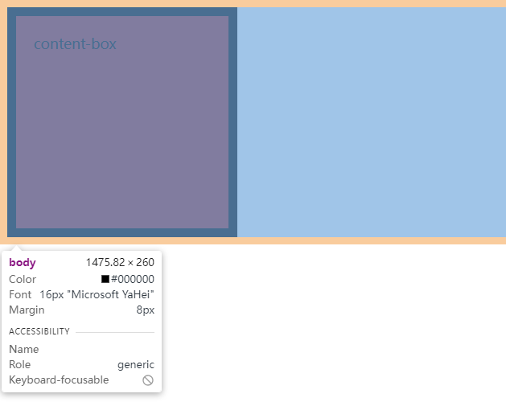
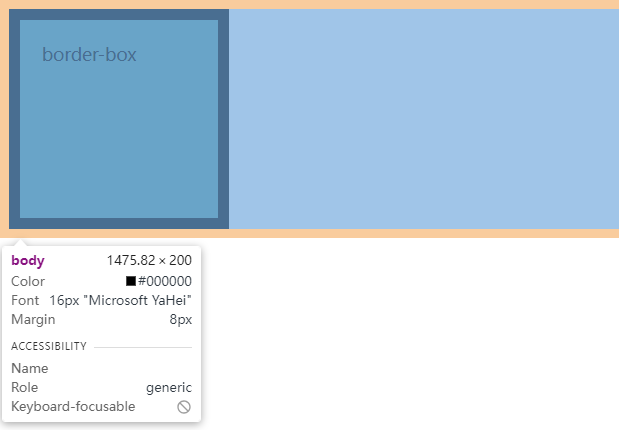

# box-sizing

`box-sizing`规定了应该如何计算元素的总宽高。总宽高的计算所涉及的范围主要有`border边框`、`padding内边距`以及`content内容`。根据不同的属性值设置，会包含不同的范围。

## 主要有以下两种属性值：

1. ### content-box

   - `默认值`

   - 元素的总宽为：`width` + `padding` + `border`
   - 元素的总高为：`height` + `padding` + `border`

2. ### border-box

   - 元素的总宽为：`width`

   - 元素的总高为：`height`


## 示例

### box-sizing:content-box

```html
<!DOCTYPE html>
<html lang="en">
<head>
  <style>
    .content-box {
      box-sizing: content-box;
      background-color: brown;

      width: 200px;
      height: 200px;
      padding: 20px;
      border: 10px solid #000;
    }
  </style>
</head>
<body>
  <div class="content-box">content-box</div>
</body>
</html>
```



总宽：width + padding + border = 200px + (20px * 2) + (10px * 2) = 260px

总高：height + padding + border = 200px + (20px * 2) + (10px * 2) = 260px


### box-sizing:border-box;

```html
<!DOCTYPE html>
<html lang="en">
<head>
  <style>
    .border-box {
      box-sizing: border-box;
      background-color: cadetblue;
      
      width: 200px;
      height: 200px;
      padding: 20px;
      border: 10px solid #000;
    }
  </style>
</head>
<body>
  <div class="border-box">border-box</div>
</body>
</html>
```



总宽：width = 200px

总高：height = 200px
