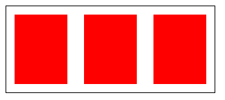
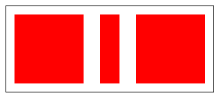

# flex为1的时候代表什么意思
首先，flex是`flex-grow`,`flex-shrink`,`flex-basic`的简写形式。
`flex`为1，实际代表的就是`flex-grow`为1，`flex-shrink`按默认的1，`flex-basic`为0%。

而`flex-grow`是用来设置元素放大比例的，尺寸的分配又依赖于`flex-basis`属性，此时它为0%，意思是从0开始扩展，分配可用空间。

举个例子，当一个250px的父元素，里面有三个定好100px的子项目，同时第一个项目设置了`flex:1`，这时，该项目的尺寸就会被设置为50px。


## 扩展例子

看看下面的例子用来加深理解。

### `flex:auto`

```html
<!DOCTYPE html>
<html lang="en">
<head>
  <meta charset="UTF-8">
  <meta name="viewport" content="width=device-width, initial-scale=1.0">
  <title>Document</title>
  <style>
    .box {
      display: flex;
      width: 300px;
      border: 1px solid #000;
    }
    .item {
      width: 100px;
      height: 100px;
      margin: 12px;
      background-color: red;
    }
    .grow {
      flex: auto;
    }
  </style>
</head>
<body>
  
  <div class="box">
    <div class="item"></div>
    <div class="item grow"></div>
    <div class="item"></div>
  </div>
</body>
</html>
```



`flex:auto`代表的是`flex:1 1 auto`，意思是`flex-grow:1`,`flex-shrink:1`,`flex-basis:auto`，所以，在分配剩余空间时，中间的元素会先占据好自己的宽度，此时由于父元素宽度不够了，所以三个项目都会被缩小，均分300px(包含外边距margin)。


### `flex:1`

```html
<!DOCTYPE html>
<html lang="en">
<head>
  <meta charset="UTF-8">
  <meta name="viewport" content="width=device-width, initial-scale=1.0">
  <title>Document</title>
  <style>
    .box {
      display: flex;
      width: 300px;
      border: 1px solid #000;
    }
    .item {
      width: 100px;
      height: 100px;
      margin: 12px;
      background-color: red;
    }
    .grow {
      flex: 1;
    }
  </style>
</head>
<body>
  
  <div class="box">
    <div class="item"></div>
    <div class="item grow"></div>
    <div class="item"></div>
  </div>
</body>
</html>
```



`flex:auto`代表的是`flex:1 1 0%`，意思是`flex-grow:1`,`flex-shrink:1`,`flex-basis:0%`，所以，在分配剩余空间时，中间的元素会从0开始扩展，此时由于父元素宽度不够了，所以该项目会被要锁，分配剩余的空间（由于`flex-shrink:1`影响的）。


### 补充

- `flex:none`是`flex: 0 0 auto`