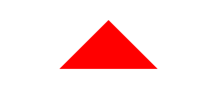

# 只用CSS画一个三角形


```html
<!DOCTYPE html>
<html lang="en">
<head>
  <style>
    .triangle {
      width: 0;
      height: 0;
      border: 100px solid transparent;
      border-bottom-color: red;
    }
  </style>
</head>
<body>
  <div class="triangle"></div>
</body>
</html>
```


