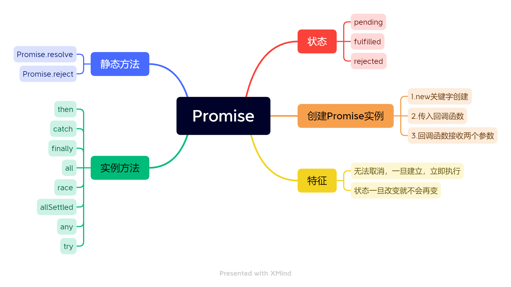

# Promise的归纳总结

<br>



​	Promise也是一种异步编程的解决方案，在ES6引入，它解决了此前使用回调函数编写异步程序所产生的`回调地狱`的问题。


## 一、状态

Promise的状态是私有的，外部不能获取到，也无法通过外部修改。它有三种状态：

1. **pending 待定**

   Promise的初始状态。

2. **fulfilled 兑现**

   调用`resolve`后，状态会流转到fulfilled，之后状态就不会再变更。

3. **rejected 拒绝**

   调用`reject`后，状态会流转到rejected，之后状态就不会再变更。


## 二、Promise实例

​	通过`new关键字`来创建一个Promise，创建时，可以传入一个回调函数，该回调函数接收两个参数，分别是`resolve`和`reject`。他们都是函数，调用resolve，Promise的状态会从pending流转到fulfilled；调用reject，Promise状态会从pending流转到rejected；该状态流转是不可逆的。

```js
new Promise((resolve, reject) => {
    resolve()	// Promise<fulfilled>
})

new Promise((resolve, reject) => {
    reject()	// Promise<rejected>
})
```


## 三、静态方法

Promise的初始状态并非一定是pending，通过以下两个静态方法来创建Promise实例，可以直接得到一个`fulfilled`或`rejected`状态的Promise。

### 1.`Promise.resolve`

​	调用该方法后，会直接返回一个`fulfilled`状态的Promise实例。

### 2.`Promise.reject`

​	调用该方法后，会直接返回一个`rejected`状态的Promise实例。


## 三、实例方法

Promise的实例方法，是连接同步代码与异步代码的桥梁。

### 1.`Promise.prototype.then`

这个方法接收两个可选的方法`onResolved`和`onRejected`，第一个是用来处理“解决”的Promise；第二个用来处理“拒绝”的Promise。这两个方法一定是互斥的。

### 2.`Promise.prototype.catch`

这个方法接收一个回调函数`onRejected`，用于处理“拒绝”的Promise。它其实相当于`.then(null, onRejected)`的语法糖。

### 3.`Promise.prototype.finally`

这个方法接收一个回调函数`onFinally`，不管Promise的状态最终进入到哪，都会调用它。

### 4.`Promise.prototype.all`

这个方法接收一个可迭代对象，该数组可以接收任意类型的值。如果这些值里面有Promise，且都为“解决”的Promise，则最终会返回一个“解决”的Promise，且返回一个对应顺序结果的数组；而如果里面有一个“拒绝”的Promise，则会返回一个“拒绝”的Promise，且返回第一个“拒绝”Promise的结果。

### 5.`Promise.prototype.race`

这个方法接收一个可迭代对象，如果里面任何一个Promise有状态变化，不管是“解决”还是“拒绝”，直接返回该Promise。

### 6.`Promise.prototype.allSettled`

`ES2020`引入的方法，主要为了解决`.all()`带来的问题。

这个方法接收一个可迭代对象，不管是“解决”还是“失败”都会返回对应顺序结果的数组。

### 7.`Promise.prototype.any`

`ES2021`引入的方法。对标`.race()`，只返回第一个“解决”的Promise。

这个方法接收一个可迭代对象，如果里面任何一个Promise的状态变为”解决“，则返回该”解决“Promise。


> Promise，首先他是一个类，可以通过`new`关键字来生成一个promise实例，这个实例有三种状态，默认是`pending`，另外两个，一个是`fulfilled`表示成功，一个是`rejected`表示失败，状态的流转也是不可逆的。
>
> 当我们new一个Promise时，可以传入一个回调函数，这个回调函数是同步执行的，他接收两个参数，这两个参数都是回调函数。第一个参数是`resolve`，调用后，状态会切换为`成功`；第二个参数是`reject`，调用后状态会切换成`失败`。
>
> promise实例可以调用`then`、`catch`和`finally`方法。首先then可以接收两个回调函数，第一个是状态为`成功`的时候执行，第二个是状态为`失败`的时候执行。
>
> `catch`是如果前面没有对失败做处理，就会执行。
>
> `finally`是不管成功还是失败，都会执行。
>
> 前面说的这三个都会继续返回一个新的promise，所以可以使用链式调用来处理；
>
> 另外，Promise也提供的一些函数用于处理多个异步任务的情况，比如`all`,`race`,`any`,`allSettled`。
>
> `all`接收一个数组，元素可以是普通类型的数据，也可以是Promise对象，如果没有状态为拒绝的promise，就会返回一个数组，里面的顺序就是传入的顺序，如果有拒绝的promise，就会返回第一个拒绝的promise。
>
> `race`也是接收一个数组，元素里面任何一个promise的状态有变化，就直接返回改promise的结果；
>
> `any`也是接收一个数组，元素里面任何一个状态变成成功，就返回该成功promise的结果，如果全都失败，就返回一个`AggregateError`；
>
> 最后`allSettled`是不管成功还是失败，都会返回所有的结果。


