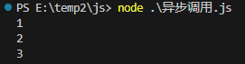
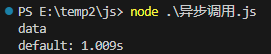

# 谈一下异步调用的发展历程

异步调用，最早是使用`回调函数`来实现的，但是使用回调函数，如果代码逻辑之前有递进关系，就会造成层层嵌套，最后难以维护，可读性也较差。

为了解决这个问题，`ES6`提供了`Promise`来解决，可以通过`then`和`catch`来处理成功和失败，支持链式调用。

后来`ES8`引入了`async/await`，形式上看着像同步操作，代码的可读性大大提高。


## 1.回调函数

```js
function foo(callback) {
  setTimeout(() => {
    callback()
  })
}

foo(() => {
  console.log('3')
})

console.log('1')
console.log('2')

```



**缺点**：

- **回调地狱**：多层回调嵌套让代码难以阅读和维护。
- **错误处理困难**：无法直接通过 `try/catch` 处理错误，需单独处理异常。
- **缺乏直观性**：代码执行顺序不明显，不符合同步编程的直观逻辑。


## 2.Promise

​	为了解决回调函数的局限性，**Promise** 在 ES6 中被引入。Promise 是一个对象，代表异步操作的最终完成或失败及其结果。它使得链式调用成为可能，并支持 `then` 和 `catch` 方法来处理异步操作的成功与失败。

```js
console.time()
const fetchData = new Promise((resolve, reject) => {
  setTimeout(() => {
    resolve("data");
  }, 1000)
})

fetchData.then((result) => {
  console.log(result)
  console.timeEnd()
}).catch((error) => {
  console.error(error)
})
```



**优点**：

- **避免回调地狱**：通过链式调用使代码结构更清晰。
- **标准化的错误处理**：可以使用 `catch` 方法统一处理错误。
- **状态明确**：Promise 有 `pending`、`fulfilled`、`rejected` 三种状态，让异步操作更加清晰。

**缺点**：

- **语法仍较复杂**：复杂的异步流程仍可能产生较多的 `then` 链，导致代码难以阅读。


## 3.Async/Await

ES8 引入了 `async/await` 关键字，使得异步代码看起来像同步代码，极大提高了代码的可读性和可维护性。`await` 会暂停异步函数的执行，直到 Promise 返回结果，再继续执行。

```js
async function fetchData() {
  try {
    const result = await new Promise((resolve) => {
      setTimeout(() => resolve("data"), 1000);
    })
    console.log(result)
  } catch (error) {
    console.error(error)
  }
}

fetchData()
```

**优点**：

- **语法简洁**：使异步代码看起来像同步代码，易读、易维护。
- **错误处理更直观**：可以直接使用 `try/catch` 进行异常处理。
- **避免链式嵌套**：消除了大量的 `then` 链，使代码更清晰。

**缺点**：

- **对兼容性有要求**：需要在支持 `async/await` 的环境中运行。
- **与传统回调难以兼容**：仍需要对部分库的回调函数进行封装转换。


