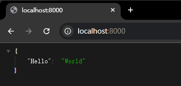
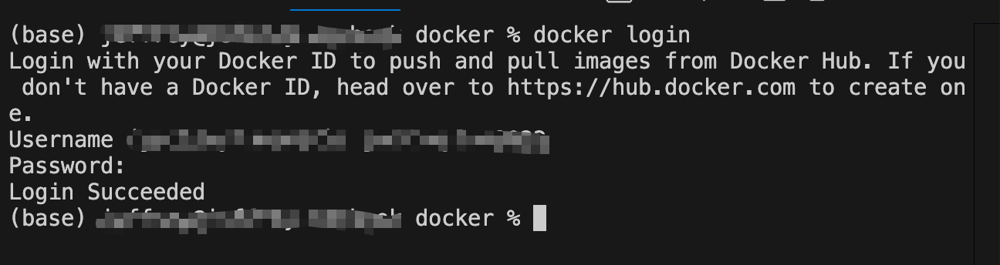
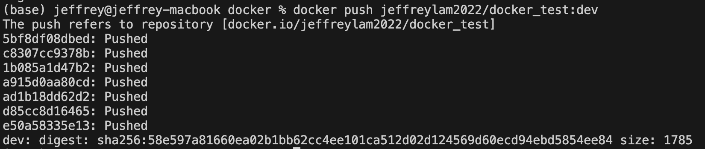
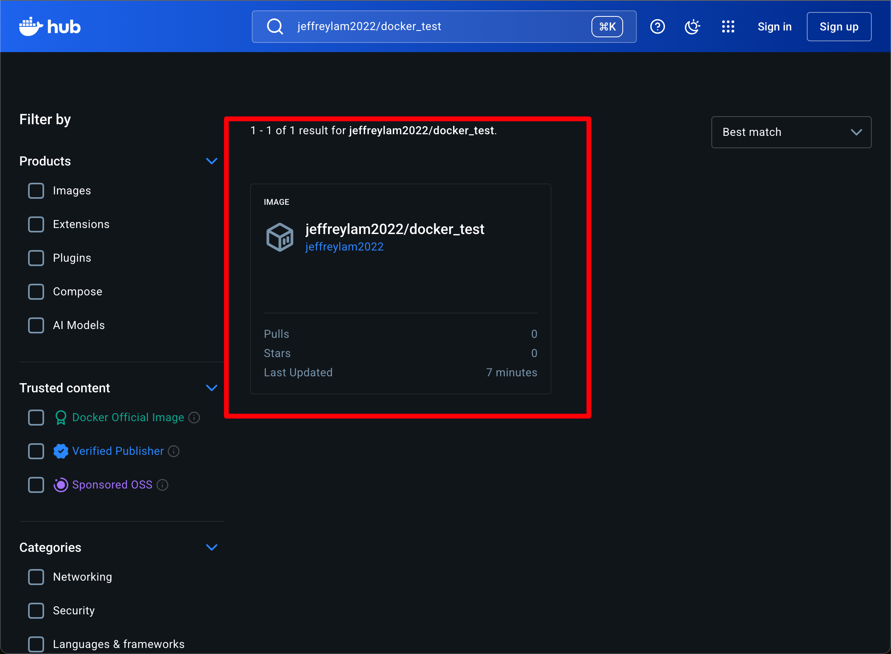
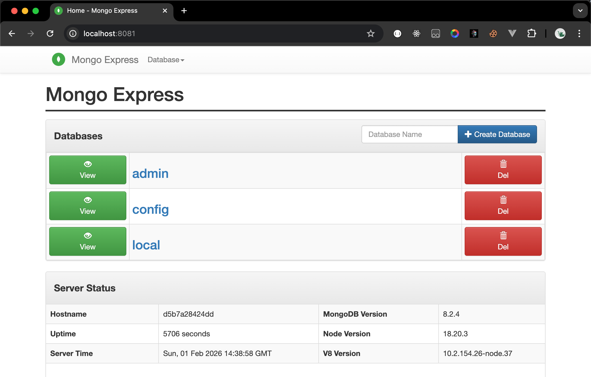
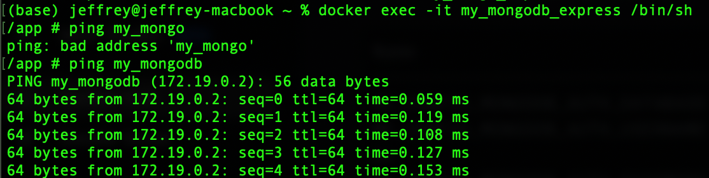
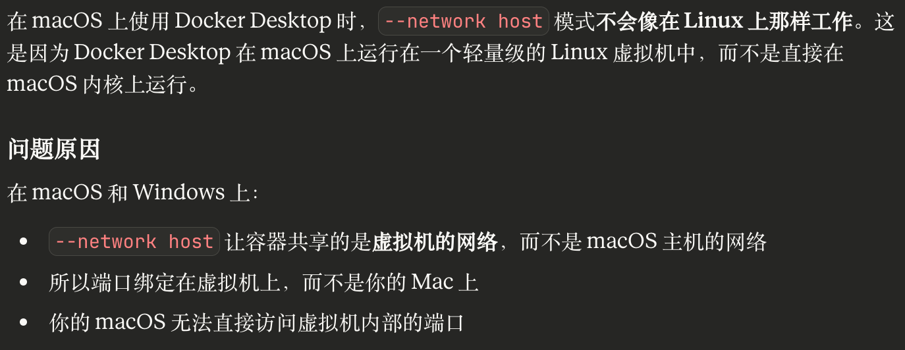
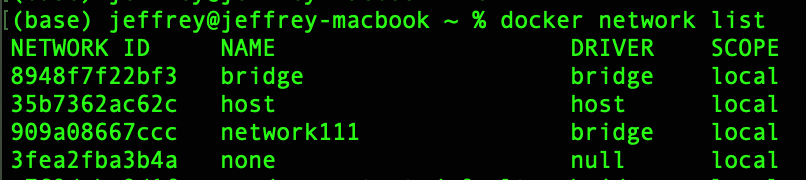

# Docker

Docker简单来说就是用容器化技术，给应用程序封装一个独立的运行环境。
给Docker运行的机器叫做宿主机器

[Docker Hub](https://hub.docker.com/)


## 一、Docker与虚拟机的区别

所有的Docker容器共用一个系统内核，而每个虚拟机都有自己独立的系统内核。
所以Docker比虚拟机更轻、更小、启动更快。


## 二、基础概念


- 镜像（Image）：Docker 镜像是一个只读的模板，包含了运行容器所需的所有文件系统结构和依赖。它类似于虚拟机的镜像，可以用于创建和启动容器。
- 容器（Container）：Docker 容器是基于镜像创建的可运行实例，包含了运行应用程序所需的所有文件系统、环境变量和配置。容器是轻量级的、可移植的，并且可以在任何支持 Docker 的平台上运行。
- 仓库（Repository）：Docker 仓库是用于存储和分发 Docker 镜像的地方。类似于代码仓库，Docker 仓库可以用于存储和管理镜像，并且可以通过 Docker 命令行工具从仓库中拉取镜像。

`	hub.docker.com`是Docker的官方仓库，里面有很多开源的镜像。


## 三、镜像源配置

完成该配置可以解决下载镜像缓慢的问题

### Windows/MacOS

打开`Docker Desktop`-`Docker Engine`，添加以下配置

```JSON
{
	"registry-mirrors": [
    "http://hub-mirror.c.163.com",
    "https://registry.docker-cn.com",
    "https://docker.mirrors.ustc.edu.cn",
    "https://docker.mirrors.ustc.edu.cn"
  ]
}
```

### Linux

```sh
sudo vi /etc/docker/daemon.json
```

添加以下配置：

```JSON
{
  "registry-mirrors": [
    "https://dockerproxy.com",
    "https://gcr.mirrors.ustc.edu.cn",
    "https://quay.mirrors.ustc.edu.cn",
    "https://reg-mirror.qiniu.com/",
    "https://docker.mirrors.ustc.edu.cn/",
    "https://hub-mirror.c.163.com/",
    "https://04elbolx.mirror.aliyuncs.com",
    "https://registry.docker-cn.com",
    "https://dockerhub.azk8s.cn",
    "https://mirror.ccs.tencentyun.com",
    "https://registry.cn-hangzhou.aliyuncs.com",
    "https://docker.m.daocloud.io",
    "https://noohub.ru",
    "https://huecker.io",
    "https://dockerhub.timeweb.cloud"
  ]
}
```


## 四、Docker命令

### 1.镜像

#### 1.1.拉取（下载）镜像

```sh
docker pull docker.io/library/nginx:latest
```

- `docker pull`：从仓库下载镜像的命令
- `docker.io`：仓库主机地址，这里的docker.io代表官方地址，是可以省略的
- `library`：命令空间，也就是作者名称。这里的library是官方仓库的命名空间，也可以省略
- `nginx`：镜像名称
- `:latest`：标签，也就是版本号。可以省略以表示下载最新版本

简化后的命令：

```sh
docker pull nginx
```

- `--platform=xxxxx`：该参数表示可以指定配置不同CPU架构版本，默认会自动选择，有需求可以直接指定

#### 1.2.查看已下载的镜像

```sh
docker images
```


#### 1.3.删除镜像

```sh
docker rmi nginx
```

可以填写镜像的`名字`或者`ID`


<hr />

### 2.容器

#### 2.1.创建并启动一个容器

```sh
docker run -d -p 11180:80 -v ./html:/usr/share/nginx/html nginx
```


- `docker run`：创建并启动一个容器的命令

- `-d`：detached mode，分离模式，表示容器在后台执行，不会阻塞当前窗口

- `-p [宿主机器端口]:[容器内部端口]`：端口映射，外部的11180端口，对应容器内部的80端口。

  ​	容器的环境与宿主机器的环境是隔离的，默认情况下是不能直接从宿主机器访问容器内部网络的，所以需要使用该命令来

- `-v [宿主机器目录]:[容器内目录]`：挂载卷，把宿主机器的文件目录与容器内部的文件目录绑定，最大的作用是持久化保存数据，因为容器删除的时候，内部的数据也会被删除，所以映射一份数据到宿主机器，我们的数据就得以保存了。

- `nginx`：启动容器所指定的镜像

使用该命令时，如果所指定的镜像没有下载，docker会自动帮我们拉取镜像，然后才启动一个容器。


#### 2.2.移除容器

```sh
docker rm -f 632e58189fb0
```


- `docker rm`：删除容器的命令
- `-f`：强制删除，如果容器正在运行，可以使用该参数进行删除
- `632e58189fb0`：容器的ID，也可以是容器名称


#### 2.3.设置环境变量

```sh
docker run -d \
-p 27017:27017 \
-e DB_USERNAME=root \
-e MONGO_INITDB_ROOT_USERNAME=root \
-e MONGO_INITDB_ROOT_PASSWORD=123456 \
mongo
```

不同容器的环境变量，可以直接去Docker Hub对应的镜像查看。


#### 2.4.给容器起自定义名称

```sh
docker run -d --name my_nginx nginx
```


#### 2.5.进入容器内部

```sh
docker run -it --rm alpine
```

- `-it`：表示让控制台进入容器内部，可以支持我们进行交互
- `--rm`：表示当容器停止时，删除容器
- `alpine`：镜像，是一个轻量级的linux系统

该命令适用于容器调试


#### 2.6.容器停止时的重启策略配置

```sh
docker run -d --restart always nginx
```

- `--restart`：配置容器在停止时的重启策略
- `always`：容器停止时，立即重启
- `unless-stopped`：与always相似，但对于手动停止的容器，不会重启


<hr />

### 3.查看docker进程

```sh
docker ps
```


注意，这里只会展示运行中的容器，如果要查看所有的，可以加上参数`-a`

```sh
docker ps -a
```


<hr />

### 4.挂载卷

#### 4.1.新增：

```sh
docker volume create nginx_html
```


使用该命令预先创建好挂载卷，之后在使用`docker run -v`的时候，就不用输入宿主机器的目录了


#### 4.2.查看挂载卷信息：

```sh
docker volume inspect nginx_html
```


#### 4.3.列出所有创建过的卷

```sh
docker volume list
```

#### 4.4.删除卷

```sh
docker volume rm nginx_html
```

#### 4.5.删除所有没有任何容器在使用的卷

```sh
docker volume prune -a
```


<hr />

### 5.容器调试

#### 5.1.停止容器

```sh
docker stop [容器的ID或者名称]
```

#### 5.2.启动容器

```sh
docker start [容器的ID或者名称]
```

#### 5.3.查看容器启动时使用的参数

```sh
docker inspect [容器的ID或者名称]
```

输入的内容可能会很多，建议直接贴给AI总结确认。

#### 5.4.只创建容器，不运行

```sh
docker create -p 11180:80 nginx
```

#### 5.5.查看容器运行日志

```sh
docker logs [容器的ID或者名称] -f
```

- `-f`,`--follow`：追踪输出，相当于实时查看当前的运行日志。

#### 5.6.在容器内部执行指定的命令

```sh
docker exec [容器ID] [Linux命令]
```


#### 5.7.进入一个正在运行的Docker容器内部

```sh
docker exec -it [容器ID] /bin/sh
```

可以获得一个交互式的命令行环境

【实践】

创建一个nginx容器，进入容器内部修改nginx提供的初始界面。

```sh
docker run -d -p 11180:80 nginx
```

然后在浏览器访问`localhost:11180`，可以看到一个nginx提供的初始界面。

（如果开了VPN可能会访问不到，可以访问`127.0.0.1:11180`试试）

接着进入容器内部，查看容器的id，然后进入容器内部

```sh
docker ps # 查看id，拷贝下来

# 进入容器
docker exec -it 85a49166abd2 /bin/sh

# 进入nginx的html目录
cd /usr/share/nginx/html
ls # 查看是否有index.html

# 尝试用vi修过index.html
vi index.html

# 如果没有vi，需要查看系统版本，进行相应工具的安装
# Debian可以使用apt
apt update # 获取最新索引
apt install vim # 安装vim工具
vi index.html # 进入文件开始修改内容，保存后刷新浏览器查看是否修改成功。
```


## 五、Dockerfile

`Dockerfile`相当于图纸，详细列出了镜像是如何制作的。

下面我们来尝试制作一个简单的镜像，并上传到Docker Hub。

写一个python脚本

`app.py`

```python
from fastapi import FastAPI
import uvicorn

app = FastAPI()

@app.get("/")

def read_root():
    return {"Hello": "World"}

if __name__ == "__main__":
    uvicorn.run(app, host="0.0.0.0", port=8000)

```

写一下用到的依赖

`requirements.txt`

```
fastapi
uvicorn
```

然后安装依赖

```sh
pip install -r ./requirements.txt
```

执行脚本

```sh
python ./app.py
```

去浏览器访问端口

```
http://localhost:8000
```



### 镜像打包

接下来把该程序打包成Docker镜像

创建一个`Dockerfile`文件，注意文件没有后缀，大小写要一致

```dockerfile
# 定义基础镜像
FROM python:3.13-slim

# 类似cd，切换到/app作为工作目录
WORKDIR /app

# 把代码文件拷贝到镜像工作目录中
# 第一个点代表本机的当前目录，第二个点代表镜像内当前的工作目录（也就是工作目录）
COPY . .

# 执行安装依赖的命令
RUN pip install -r ./requirements.txt

# 声明镜像服务提供的端口号，其实算是一个说明，不写也不会影响程序
EXPOSE 8000

# CMD是容器运行时的默认启动命令，当容器启动的时候，容器内部会自动执行这个命令
# 一个Dockerfile里面只能写一个，最好以数组形式编写，不要有空格
CMD ["python", "app.py"]

# 类似的还有ENTRYPOINT，它的优先级更高一些


```

执行镜像制作命令

```sh
docker build -t docker_test .
```

`-t`指定镜像名称

`.`指的是在当前文件夹下构建


接着基于这个镜像创建一个容器，测试该镜像是否有问题

```sh
docker run -d -p 8000:8000 docker_test
```

启动成功以后，在浏览器访问`localhost:8000`，如果能得到JSON内容，说明成功了。

### 镜像发布

接下来尝试把镜像发布到`Docker Hub`，发布之前要先去[官网](https://hub.docker.com/)注册账号。

注册好之后，先在`Docker Desktop`软件上登录，然后在命令行输入：

```sh
docker login
```

再次输入用户名和密码，登录成功后，命令行会显示`Login Succeeded`




接下来，重新打包镜像，这次打包要在镜像名的前面加上自己的用户名

```sh
docker build -t jeffreylam2022/docker_test .
```

打包成功后，推送

```sh
docker push jeffreylam2022/docker_test:latest
```



去[`Docker Hub`](https://hub.docker.com/explore)上搜索自己的镜像`jeffreylam2022/docker_test`




如果推送遇到报错

```sh
unauthorized: access token has insufficient scopes
```

有两种可能：

- 未登录成功
- 在`Docker Hub`上面还没有docker_test这个仓库，需要手动创建

尝试重新登录

```sh
docker logout

docker login -u jeffreylam2022

docker push jeffreylam2022/docker_test:latest
```


## 六、Docker网络

### 6.1.桥接模式

Docker的网络默认是Bridge（桥接模式）,使所有的容器默认连接到该网络，每个容器都会被分配一个内部的ip地址，在该内部网络中，容器之间可以通过ip地址相互访问，但容器与宿主机的网络是相互隔离的。


创建子网：

```sh
docker network create network111
```

同一个子网的容器可以相互通信，不同子网的则不行。

同一子网的容器可以使用容器名字相互访问，不需要使用IP地址，不同子网则不行。


创建mongodb容器并指定子网`network111`

```sh
docker run -d --name my_mongodb \
-e MONGO_INITDB_ROOT_USERNAME=root \
-e MONGO_INITDB_ROOT_PASSWORD=123456 \
--network network111 \
mongo
```

创建`mongo-express`容器，同样指定子网`network111`，

```sh
docker run -d \
--name my_mongodb_express \
-p 8081:8081 \
-e ME_CONFIG_MONGODB_SERVER=my_mongodb \
-e ME_CONFIG_MONGODB_ADMINUSERNAME=root \
-e ME_CONFIG_MONGODB_ADMINPASSWORD=123456 \
--network network111 \
mongo-express
```

使用浏览器访问`localhost:8081`

默认的用户名密码：`admin/pass`



进入`mongo-express`容器，尝试ping

```sh
docker exec -it my_mongodb_express /bin/sh

ping my_mongodb
```

不需要使用ip地址，docker内部有DNS机制。



### 6.2.host模式

Docker容器直接共享宿主机器的网络，容器直接使用宿主的ip地址，不需要使用`-p`参数进行端口映射。

使用host模式启动nginx：

```sh
docker run -d --network host nginx
```

浏览器访问服务器的地址加上端口80，就能访问到nginx了。

> 注意，仅在Linux能实现。
>
> 

进入容器内部看看ip地址：

```sh
docker ps # 找到容器的id

docker exec -it [容器ID] /bin/sh

# 安装工具
apt update
apt install iproute2
# 查看ip
ip addr show
```

可以看到容器的ip与服务器的ip是一样的。

### 6.3.None模式

无网络模式

### 6.4.其他

查看Docker所有网络：

```sh
docker network list
```



移除网络：

```sh
docker network rm
```

默认网络（`bridge`、`host`、`none`）是不能删除的，只能删除自定义的子网


## 七、Docker Compose


