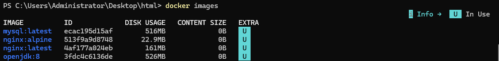
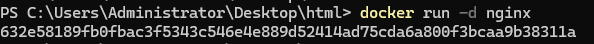
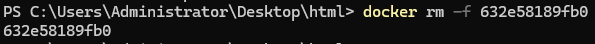
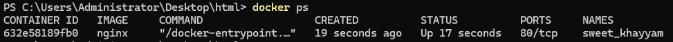
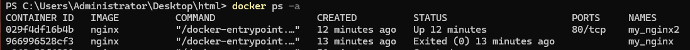
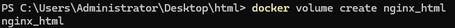

# Docker

Docker简单来说就是用容器化技术，给应用程序封装一个独立的运行环境。
给Docker运行的机器叫做宿主机器

[Docker Hub](https://hub.docker.com/)


## 一、Docker与虚拟机的区别

所有的Docker容器共用一个系统内核，而每个虚拟机都有自己独立的系统内核。
所以Docker比虚拟机更轻、更小、启动更快。


## 二、基础概念


- 镜像（Image）：Docker 镜像是一个只读的模板，包含了运行容器所需的所有文件系统结构和依赖。它类似于虚拟机的镜像，可以用于创建和启动容器。
- 容器（Container）：Docker 容器是基于镜像创建的可运行实例，包含了运行应用程序所需的所有文件系统、环境变量和配置。容器是轻量级的、可移植的，并且可以在任何支持 Docker 的平台上运行。
- 仓库（Repository）：Docker 仓库是用于存储和分发 Docker 镜像的地方。类似于代码仓库，Docker 仓库可以用于存储和管理镜像，并且可以通过 Docker 命令行工具从仓库中拉取镜像。

`	hub.docker.com`是Docker的官方仓库，里面有很多开源的镜像。

## 

## 三、镜像源配置

完成该配置可以解决下载镜像缓慢的问题

### Windows/MacOS

打开`Docker Desktop`-`Docker Engine`，添加以下配置

```JSON
{
	"registry-mirrors": [
    "http://hub-mirror.c.163.com",
    "https://registry.docker-cn.com",
    "https://docker.mirrors.ustc.edu.cn",
    "https://docker.mirrors.ustc.edu.cn"
  ]
}
```

### Linux

```sh
sudo vi /etc/docker/daemon.json
```

添加以下配置：

```JSON
{
  "registry-mirrors": [
    "https://dockerproxy.com",
    "https://gcr.mirrors.ustc.edu.cn",
    "https://quay.mirrors.ustc.edu.cn",
    "https://reg-mirror.qiniu.com/",
    "https://docker.mirrors.ustc.edu.cn/",
    "https://hub-mirror.c.163.com/",
    "https://04elbolx.mirror.aliyuncs.com",
    "https://registry.docker-cn.com",
    "https://dockerhub.azk8s.cn",
    "https://mirror.ccs.tencentyun.com",
    "https://registry.cn-hangzhou.aliyuncs.com",
    "https://docker.m.daocloud.io",
    "https://noohub.ru",
    "https://huecker.io",
    "https://dockerhub.timeweb.cloud"
  ]
}
```


## 四、Docker命令

### 1.镜像

#### 1.1.拉取（下载）镜像

```sh
docker pull docker.io/library/nginx:latest
```

- `docker pull`：从仓库下载镜像的命令
- `docker.io`：仓库主机地址，这里的docker.io代表官方地址，是可以省略的
- `library`：命令空间，也就是作者名称。这里的library是官方仓库的命名空间，也可以省略
- `nginx`：镜像名称
- `:latest`：标签，也就是版本号。可以省略以表示下载最新版本

简化后的命令：

```sh
docker pull nginx
```

- `--platform=xxxxx`：该参数表示可以指定配置不同CPU架构版本，默认会自动选择，有需求可以直接指定

#### 1.2.查看已下载的镜像

```sh
docker images
```




#### 1.3.删除镜像

```sh
docker rmi nginx
```

可以填写镜像的`名字`或者`ID`


<hr />

### 2.容器

#### 2.1.创建并启动一个容器

```sh
docker run -d -p 11180:80 -v ./html:/usr/share/nginx/html nginx
```



- `docker run`：创建并启动一个容器的命令

- `-d`：detached mode，分离模式，表示容器在后台执行，不会阻塞当前窗口

- `-p [宿主机器端口]:[容器内部端口]`：端口映射，外部的11180端口，对应容器内部的80端口。

  ​	容器的环境与宿主机器的环境是隔离的，默认情况下是不能直接从宿主机器访问容器内部网络的，所以需要使用该命令来

- `-v [宿主机器目录]:[容器内目录]`：挂载卷，把宿主机器的文件目录与容器内部的文件目录绑定，最大的作用是持久化保存数据，因为容器删除的时候，内部的数据也会被删除，所以映射一份数据到宿主机器，我们的数据就得以保存了。

- `nginx`：启动容器所指定的镜像

使用该命令时，如果所指定的镜像没有下载，docker会自动帮我们拉取镜像，然后才启动一个容器。


#### 2.2.移除容器

```sh
docker rm -f 632e58189fb0
```



- `docker rm`：删除容器的命令
- `-f`：强制删除，如果容器正在运行，可以使用该参数进行删除
- `632e58189fb0`：容器的ID，也可以是容器名称


#### 2.3.设置环境变量

```sh
docker run -d \
-p 27017:27017 \
-e DB_USERNAME=root \
-e MONGO_INITDB_ROOT_USERNAME=root \
-e MONGO_INITDB_ROOT_PASSWORD=123456 \
mongo
```

不同容器的环境变量，可以直接去Docker Hub对应的镜像查看。


#### 2.4.给容器起自定义名称

```sh
docker run -d --name my_nginx nginx
```


#### 2.5.进入容器内部

```sh
docker run -it --rm alpine
```

- `-it`：表示让控制台进入容器内部，可以支持我们进行交互
- `--rm`：表示当容器停止时，删除容器
- `alpine`：镜像，是一个轻量级的linux系统

该命令适用于容器调试


#### 2.6.容器停止时的重启策略配置

```sh
docker run -d --restart always nginx
```

- `--restart`：配置容器在停止时的重启策略
- `always`：容器停止时，立即重启
- `unless-stopped`：与always相似，但对于手动停止的容器，不会重启


<hr />

### 3.查看docker进程

```sh
docker ps
```



注意，这里只会展示运行中的容器，如果要查看所有的，可以加上参数`-a`

```sh
docker ps -a
```




<hr />

### 4.挂载卷

#### 4.1.新增：

```sh
docker volume create nginx_html
```



使用该命令预先创建好挂载卷，之后在使用`docker run -v`的时候，就不用输入宿主机器的目录了


#### 4.2.查看挂载卷信息：

```sh
docker volume inspect nginx_html
```


#### 4.3.列出所有创建过的卷

```sh
docker volume list
```

#### 4.4.删除卷

```sh
docker volume rm nginx_html
```

#### 4.5.删除所有没有任何容器在使用的卷

```sh
docker volume prune -a
```


<hr />

### 5.容器调试

#### 5.1.停止容器

```sh
docker stop [容器的ID或者名称]
```

#### 5.2.启动容器

```sh
docker start [容器的ID或者名称]
```


#### 5.3.查看容器启动时使用的参数

```sh
docker inspect [容器的ID或者名称]
```

输入的内容可能会很多，建议直接贴给AI总结确认。


#### 5.4.只创建容器，不运行

```sh
docker create -p 11180:80 nginx
```


#### 5.5.查看容器运行日志

```sh
docker logs [容器的ID或者名称] -f
```

- `-f`,`--follow`：追踪输出，相当于实时查看当前的运行日志。


#### 5.6.执行指定的命令