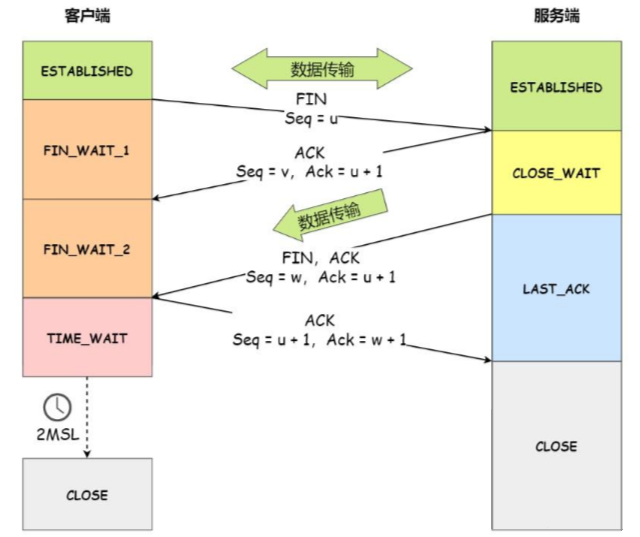

# 讲一下TCP的四次挥手

第一次挥手：

首先，客户端向服务端发起断开连接的请求；报文中FIN为1，并带上一个随机序号seq，假定为x。

第二次挥手：

接着，服务端响应，报文中ACK为1，确认号ack为x+1，还有生成随机序列号seq假定为y。

第三次挥手：

接着，还是服务端发送关闭请求，报文中，FIN为1，ACK为1，序列号为w，确认号为x+1。

第四次挥手：

最后，客户端响应确认，报文中，ACK=1，ack确认号为y+1，序列号为x+1

> 记忆：关键标记的数量：2->3->4->3
>
> 2：FIN=1,seq=x
>
> 3：ACK=1,seq=y,ack=x+1
>
> 4：FIN=1,ACK=1,seq=w,ack=x+1
>
> 3：ACK=1,seq=x+1,ack=w+1

