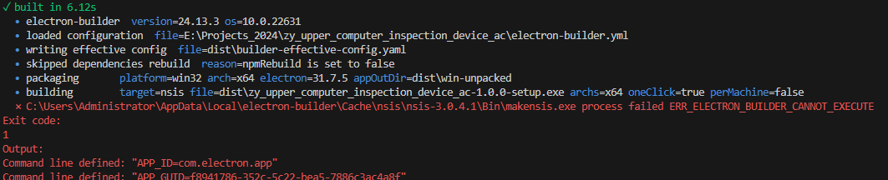
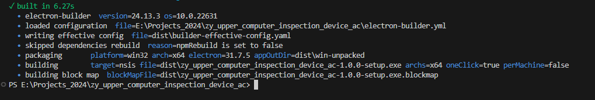

# electron-vite打包makensis.exe报错


报错内容：




解决方案：在`.npmrc`添加内容：

```sh
strict-ssl=false
electron_mirror=https://npmmirror.com/mirrors/electron/
electron_builder_binaries_mirror=https://npmmirror.com/mirrors/electron-builder-binaries/
shamefully-hoist=true

# 新增以下两条配置：
node-linker=hoisted
public-hoist-pattern=*
```

再次尝试

```sh
pnpm run build:win
```

成功！




具体版本看`package.json`

```json
{
  "name": "zy_upper_computer_inspection_device_ac",
  "version": "1.0.0",
  "description": "An Electron application with Vue and TypeScript",
  "main": "./out/main/index.js",
  "author": "example.com",
  "homepage": "https://electron-vite.org",
  "scripts": {
    "format": "prettier --write .",
    "lint": "eslint . --ext .js,.jsx,.cjs,.mjs,.ts,.tsx,.cts,.mts,.vue --fix",
    "typecheck:node": "tsc --noEmit -p tsconfig.node.json --composite false",
    "typecheck:web": "vue-tsc --noEmit -p tsconfig.web.json --composite false",
    "typecheck": "npm run typecheck:node && npm run typecheck:web",
    "start": "chcp 65001 && electron-vite preview",
    "dev": "chcp 65001 && electron-vite dev",
    "build": "npm run typecheck && electron-vite build",
    "postinstall": "electron-builder install-app-deps",
    "build:unpack": "npm run build && electron-builder --dir",
    "build:win": "npm run build && electron-builder --win",
    "build:mac": "npm run build && electron-builder --mac",
    "build:linux": "npm run build && electron-builder --linux"
  },
  "dependencies": {
    "@electron-toolkit/preload": "^3.0.0",
    "@electron-toolkit/utils": "^3.0.0",
  },
  "devDependencies": {
    "@electron-toolkit/eslint-config": "^1.0.2",
    "@electron-toolkit/eslint-config-ts": "^2.0.0",
    "@electron-toolkit/tsconfig": "^1.0.1",
    "@rushstack/eslint-patch": "^1.10.3",
    "@types/node": "^20.14.8",
    "@vitejs/plugin-vue": "^5.0.5",
    "@vue/eslint-config-prettier": "^9.0.0",
    "@vue/eslint-config-typescript": "^13.0.0",
    "electron": "^31.0.2",
    "electron-builder": "^24.13.3",
    "electron-vite": "^2.3.0",
    "eslint": "^8.57.0",
    "eslint-plugin-vue": "^9.26.0",
    "prettier": "^3.3.2",
    "typescript": "^5.5.2",
    "vite": "^5.3.1",
    "vue": "^3.4.30",
    "vue-tsc": "^2.0.22"
  },
}

```

