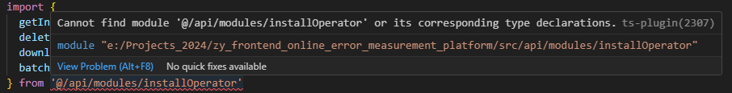
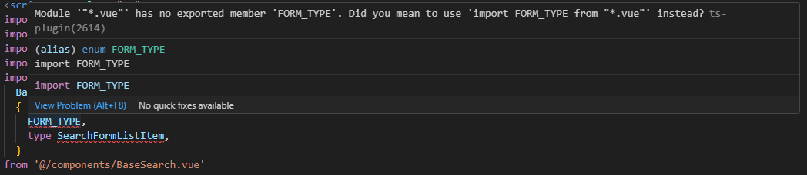
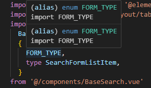

# Vue组件引入@开头的路径报错

## 使用的工具版本

- vue: 3.5.12
- typescript: 5.6.2
- vite: 5.4.9


## 报错提示内容






当改为`'../../components/BaseSearch.vue'`就不报错了，说明是`'@/'`开头的问题。


## 解决方法

在ts配置文件中加上配置项

```json
// tsconfig.app.json
{
  "compilerOptions": {
    "baseUrl": ".",
    "paths": {
      "@/*": ["src/*"]
    }
  }
}
```



如果还是解决不了，就确认一下`vite.config.ts`中，`Vue`的组件定义

确认是否使用了`DefineComponent `

```typescript
/// <reference types="vite/client" />

declare module "*.vue" {
  import { DefineComponent } from "vue";
  const component: DefineComponent<{}, {}, any>;
  export default component;
}

```

## 补充

要使用`’@/‘`别名，需要先在`vite.config.ts`中设置

```js
import { fileURLToPath, URL } from 'node:url'
import { defineConfig } from 'vite'

export default defineConfig(() => {
  return {
    resolve: {
      alias: {
        '@': fileURLToPath(new URL('./src', import.meta.url))
      }
    }
  }
})

```

