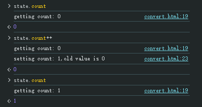

# 数据劫持

Vue2的数据劫持主要通过`Object.defineProperty()`来实现，通过设置`getter`和`setter`完成。


```js
const state = {
  count: 0
}

convert(state)

function convert(obj) {
  Object.keys(obj).forEach(key => {
    if(typeof obj[key] === 'object') {
      convert(obj[key])
    }

    let internalVal = obj[key]
    Object.defineProperty(obj, key, {
      get() {
        console.log(`getting ${key}: ${ internalVal}`)
        return internalVal
      },
      set(newVal) {
        console.log(`setting ${key}: ${ newVal },old value is ${internalVal}`)
        internalVal = newVal
      }
    })
  })
}
```




