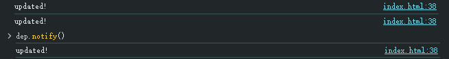

# 依赖追踪

我们如何去理解`依赖`这个概念呢？

我们定义一个叫`Dep`类，这个类有两个方法，一个是`depend`，一个是`notify`。
`depend`用于收集依赖，即把依赖这个状态的代码（也就是回调函数）保存起来。
`notify`用于将之前收集到的所有依赖代码，重新执行。

然后我们会定义一个函数`autoRun()`，这个函数用于接收一个更新函数，当我们执行`autoRun()`时，会执行传入的更新函数，并保存更新函数，当`notify`被调用时，会重新执行更新函数。

## 练习：实现依赖追踪

```js
class Dep {
  // TODO：补充完整
}
function autoRun() {
  // TODO：补充完整
}

const dep = new Dep()

autoRun(() => {
  dep.depend()
  console.log('updated!')
})
// 输出日志: "updated!"

dep.notify()  // 输出日志: "updated!"

```

## 答案
```js
let activeUpdate = null

class Dep {
  constructor() {
    this.subscribers = new Set()
  }
  depend() {
    if(activeUpdate) {
      this.subscribers.add(activeUpdate)
    }
  }
  notify() {
    this.subscribers.forEach(sub => sub())
  }
}
function autoRun(update) {
  function wrapUpdate() {
    activeUpdate = update
    update()
    activeUpdate = null
  }
  wrapUpdate()
}

const dep = new Dep()

autoRun(() => {
  dep.depend()
  console.log('updated!')
})
// 输出日志: "updated!"

dep.notify()  // 输出日志: "updated!"


```



执行顺序就是：

1. 实例化`Dep`
2. 调用`autoRun()`
3. 将传入`autoRun()`的更新函数`update()`保存到变量`activeUpdate`，然后执行更新函数`update()`
4. 执行更新函数时，会执行`dep.depend()`实现依赖保存，然后将`activeUpdate`重置为空
5. 接下来开始调用`dep.notify()`，执行重新执行更新函数
6. 这次执行更新函数时，虽然也调用了`dep.depend()`，但由于`activeUpdate`为空，所以依赖没有重复保存，然后就直接执行了`console.log('updated!')`


如此我们便成功实现了依赖追踪。


