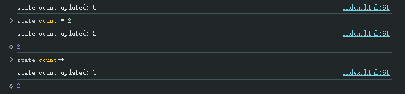

# 迷你观察者

要实现一个迷你的观察者，我们可以结合前面所学的`数据劫持`和`依赖追踪`，两者融合在一起来完成实现。

我们将前面的`convert()`改名为`observer()`，`autoRun()`改名为`watchEffect()`

配合`getter`和`setter`实现依赖的绑定和通知，可以理解成发布订阅的模式。

## 练习
```js
function observer(obj) {
  // TODO: 实现
}
class Dep {
  // TODO: 实现
}
function watchEffect(fn) {
  // TODO: 实现
}

const state = {
  count: 0
}
observer(state)
watchEffect(() => {
  console.log(`state.count updated: ${state.count}`)
})

```

## 答案

```js

function observer(obj) {
  Object.keys(obj).forEach(key => {
    if(obj[key] === 'object') {
      observer(obj[key])
    }
    let internalVal = obj[key]
    Object.defineProperty(obj, key, {
      get() {
        dep.depend()
        return internalVal
      },
      set(newVal) {
        internalVal = newVal
        dep.notify()
      }
    })
  })
}

class Dep {
  constructor() {
    this.subscribers = new Set()
  }
  depend() {
    if(activeFn) {
      this.subscribers.add(activeFn)
    }
  }
  notify() {
    this.subscribers.forEach(sub => sub())
  }
}
const dep = new Dep()

let activeFn = null

function watchEffect(fn) {
  function wrapFn() {
    activeFn = fn
    fn()
    activeFn = null
  }
  wrapFn()
}

const state = {
  count: 0
}
observer(state)
watchEffect(() => {
  console.log(`state.count updated: ${state.count}`)	// 第一次执行，就在getter里面加入了依赖
})
```




至此，我们成功实现了最基本的响应式引擎，这就是Vue更新系统工作原理的简单版本。

当前还代码存在很多边缘性的问题，比如没有处理数组，没有处理嵌套对象等等。这些我们不再展开，详细的可以直接阅读源码学习，我们只需要知道Vue的响应式系统大致的实现原理即可。

接下来，我们进入下一个话题：[插件编写](./4.插件编写.md)


