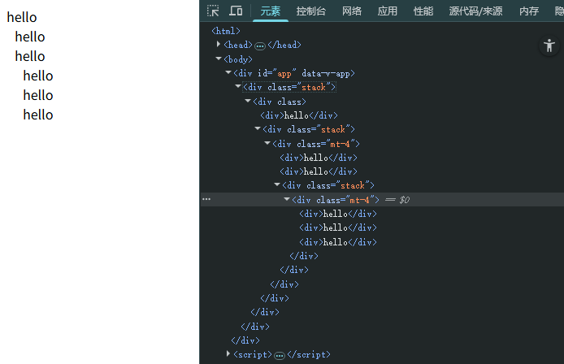

# 渲染函数

Vue3对render函数的使用做了简化，主要在于props的扁平化，可以看看下面的例子：

```js
// Vue2 API
render(h) {
  return h('div', {
    attrs: {
      id: 'box'
    },
    on: {
      click: () => console.log('click')
    }
  }, 'hello vue2')
}
```


```js
// Vue3 API
import { h } from 'vue'

render() {
  return h('div', {
    id: 'box',
    onClick: () => console.log('click')
  }, 'hello vue3')
}
```
- 在Vue3中，`h`函数可以直接通过`import`来引入；在Vue2中,当我们分割渲染函数时，需要不断传递该`h`变量，在Vue3可以避免这个麻烦的操作了。
- 按照惯例，所有以`on`开头的属性，都会被自动绑定为一个监听器；
- 另外，也不需要考虑属性是应该绑定在`attrs`还是`props`，Vue3会先检查属性是否在原生DOM中属于属性key，如果属于，就会自动设置为原生属性，反之，作为props传递给组件。

## 链接

- [Vue3 Template Explorer](https://template-explorer.vuejs.org/)：可以看到我们的模板被编译成什么样子

## 练习
接下来我们配合`插槽`的使用来完成一个练习。

在Vue3的中，插槽被保存在`$slots`对象中，默认是`$slots.default`，如果需要具名插槽，则使用`$slots.xxx`来获取。

题目：
```html
<!--  将下面这个组件模板，渲染成嵌套分级树列表 -->
<Stack>
  <div>hello</div>
  <Stack size="4">
    <div>hello</div>
    <div>hello</div>
    <Stack size="4">
      <div>hello</div>
      <div>hello</div>
      <div>hello</div>
    </Stack>
  </Stack>
</Stack>

<!-- 得到下面这个结构 -->
<div class="stack">
  <div>
    <div>hello</div>
    <div class="stack">
      <div class="mt-4">
        <div>hello</div>
        <div>hello</div>
        <div class="stack">
          <div class="mt-4">
            <div>hello</div>
            <div>hello</div>
            <div>hello</div>
          </div>
        </div>
      </div>
    </div>
  </div>
</div>
```



将下面的代码补充完整：

```html
<script src="http://unpkg.com/vue@latest"></script>

<style>
  .mt-4 {
    margin-left: 10px;
  }
</style>
<div id="app"></div>

<script>

  const { h, createApp } = Vue

  const Stack = {
    // TODO
  }

  const App = {
    components: { Stack },
    template: `
      <Stack size="4">
        <div>hello</div>
        <Stack size="4">
          <div>hello</div>
          <div>hello</div>
          <Stack size="4">
            <div>hello</div>
            <div>hello</div>
            <div>hello</div>
          </Stack>
        </Stack>
      </Stack>
    `
  }

  createApp(App).mount('#app')


</script>

```

答案：
```js
// 省略其他代码
const Stack = {
  props: ['size'],
  render() {
    const slot = this.$slots.default
      ? this.$slots.default()
      : []

    return h('div',{ class: 'stack' }, h('div', {
      class: [
        this.$props.size ? 'mt-' + this.$props.size : ''
      ]
    }, slot))
  }
}

```