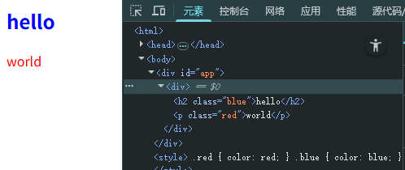

# 实现h函数

# 练习
```html
<style>
  .red { color: red; }
  .blue { color: blue;  }
</style>

<div id="app"></div>

<script>
function h(tag, props, children) {
  // TODO
}

function mount(vnode, container) {
  // TODO
}

const vnode = h('div', null, [
  h('h2', { class: 'blue' }, 'hello'),
  h('p', { class: 'red' }, 'world')
])

mount(vnode, document.querySelector('#app'))

</script>

```



答案：

```html
<!-- 已省略其他代码 -->
<script>
function h(tag, props, children) {
  return {
    tag,
    props,
    children
  }
}

function mount(vnode, container) {

  const { tag, props, children } = vnode
  const el = document.createElement(tag)

  if(props) {
    for(const key in props) {
      const value = props[key]
      el.setAttribute(key, value)
    }
  }

  if(children) {
    if(typeof children === 'string') {
      el.textContent = children
    } else {
      children.forEach(child => {
        mount(child, el)
      })
    }
  }

  container.appendChild(el)
}


</script>

```

有了h函数，我们就可以通过h函数来创建虚拟节点，然后通过mount函数将虚拟节点渲染到页面上。
接下来，对于虚拟节点的更新，我们需要实现patch函数。