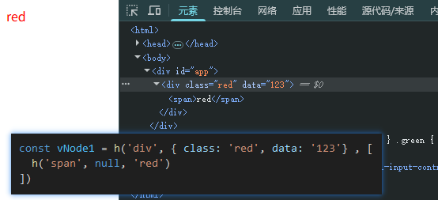
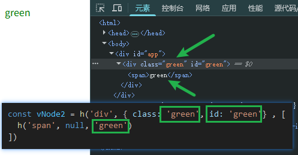

# 实现patch函数

## 练习

```html

<script>
// 已省略其他代码
function mount(vNode, container) {

  const { tag, props, children } = vNode
  // 注意：mount做了以下修改
  // 将el保存在每一个vNode中，方便后续更新DOM时使用
  const el = vNode.el = document.createElement(tag)
  if(props) {
    for(const key in props) {
      const value = props[key]
      el.setAttribute(key, value)
    }
  }

  if(children) {
    if(typeof children === 'string') {
      el.textContent = children
    } else {
      children.forEach(child => {
        mount(child, el)
      })
    }
  }

  container.appendChild(el)
}

function patch(n1, n2) {
  // TODO
}

const vNode1 = h('div', { class: 'red'} , [
  h('span', 'red')
])
const vNode2 = h('div', { class: 'green'} , [
  h('span', 'green')
])

patch(vNode1, vNode2)

</script>

```

patch前：



patch后：




答案：

```html
<div id="app"></div>

<style>
  .red { color: red; }
  .green { color: green; }
</style>

<script>
  
const vNode1 = h('div', { class: 'red', data: '123'} , [
  h('span', null, 'red')
])
const vNode2 = h('div', { class: 'green', id: 'green'} , [
  h('span', null, 'green')
])

function h(tag, props, children) {
  return {
    tag,
    props,
    children
  }
}

function mount(vNode, container) {

  const { tag, props, children } = vNode

  const el = vNode.el = document.createElement(tag)
  
  if(props) {
    for(const key in props) {
      const value = props[key]
      el.setAttribute(key, value)
    }
  }

  if(children) {
    if(typeof children === 'string') {
      el.textContent = children
    } else {
      children.forEach(child => {
        mount(child, el)
      })
    }
  }

  container.appendChild(el)
}


mount(vNode1, document.querySelector('#app'))


function patch(n1, n2) {
  // tag
  if(n1.tag === n2.tag) {
    const el = n2.el = n1.el

    // props
    const oldProps = n1.props
    const newProps = n2.props

    for(const key in newProps) {
      const oldValue = oldProps[key]
      const newValue = newProps[key]
      if(oldValue !== newValue) {
        el.setAttribute(key, newValue)
      }
    }
    for(const key in oldProps) {
      if(!newProps[key]) {
        el.removeAttribute(key)
      }
    }

    // children
    const oldChildren = n1.children
    const newChildren = n2.children
    if(typeof newChildren === 'string'){

      if(typeof oldChildren === 'string') {
        if(oldChildren !== newChildren) {
          el.textContent = newChildren
        }
      } else {
        el.innerHTML = newChildrenValue
      }

    } else {
      if(typeof oldChildren === 'string') {
        newChildren.forEach(child => {
          mount(child, el)
        })
      } else {
        const oldLen = oldChildren.length
        const newLen = newChildren.length
        const commonLen = Math.min(oldLen, newLen)

        for(let i = 0; i < commonLen; i++) {
          // not optimized
          // 潜在效率问题：相同的节点仍然会被进行比对
          patch(oldChildren[i], newChildren[i])
        }

        if(newLen > oldLen) {
          // 节点增加了
          newChildren.slice(oldLen).forEach(child => {
            mount(child, el)
          })
        } else if (newLen < oldLen) {
          // 节点减少了
          oldChildren.slice(newLen).forEach(child => {
            el.removeChild(child.el)
          })
        }
      }
    }
  } else {
    // 暂不考虑该情况
  }
}

patch(vNode1, vNode2) // 这句可以试着在控制台调用，直接看到更新效率

</script>
```