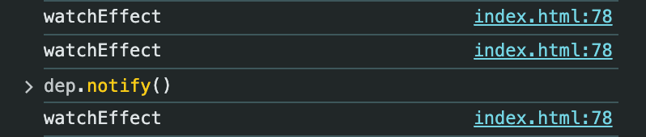
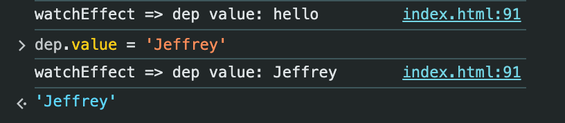

# 依赖追踪

本节练习，来实现Vue的依赖追踪，我们分两步走：
1. 构建watchEffect和Dep依赖追踪，让他们成功起到作用
2. 把dep与一个值相关联，让该值被读取和设置时，也能触发依赖追踪


## 一、实现基本的watchEffect和依赖追踪

```html
<script src="./node_modules/vue/dist/vue.global.js"></script>

<script>

class Dep {
  subscribers = new Set()

  depend() {
    if(activeEffect) {
      this.subscribers.add(activeEffect)
    }
  }

  notify() {
    this.subscribers.forEach(effect => {
      effect()
    })
  }
}
let activeEffect = null

const dep = new Dep()

watchEffect(() => {
  dep.depend()
  console.log('watchEffect')
})

function watchEffect(effect) {
  activeEffect = effect
  activeEffect()
  activeEffect = null
}

dep.notify()

</script>
```



第一次输出是调用`watchEffect`时触发的；

第二次输出是代码最底下调用`dep.notify()`输出的；

第三次是在控制台调用`dep.notify()`输出的。


## 让dep绑定一个值，实现该值的依赖追踪

```html


<script src="./node_modules/vue/dist/vue.global.js"></script>

<script>

class Dep {
  subscribers = new Set()
  
  constructor(value) {
    this._value = value
  }

  get value() {
    this.depend()
    return this._value
  }

  set value(newValue) {
    this._value = newValue
    this.notify()
  }

  depend() {
    if(activeEffect) {
      this.subscribers.add(activeEffect)
    }
  }

  notify() {
    this.subscribers.forEach(effect => {
      effect()
    })
  }
}
let activeEffect = null

const dep = new Dep('hello')

watchEffect(() => {
  console.log('watchEffect => dep value:', dep.value)
})

function watchEffect(effect) {
  activeEffect = effect
  activeEffect()
  activeEffect = null
}


</script>
```



通过设置`value`的`getter`和`setter`来实现依赖的绑定和更新通知，这样就不用显示得去调用`dep.depend()`和`dep.notify()`。发现了没？这个很像Vue3的`ref`API。


