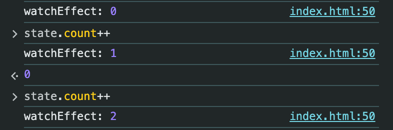
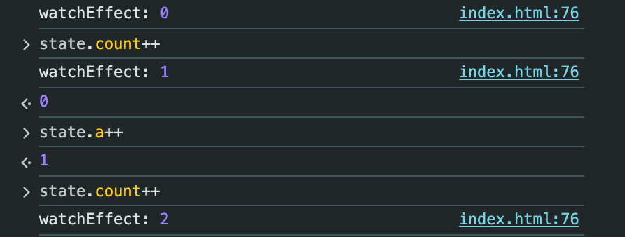
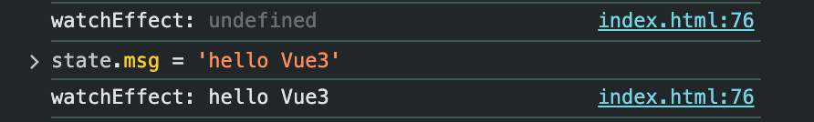
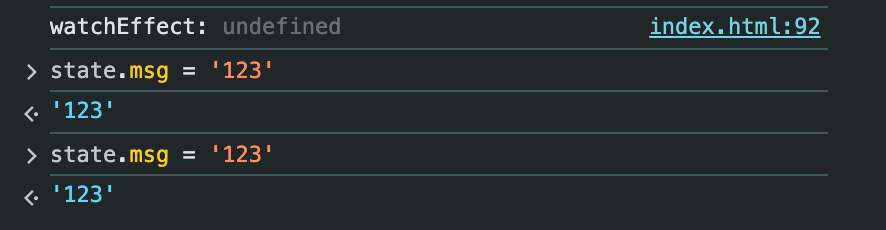

# 响应性实现

Vue3的组合式API中，提供了`reactive`和`ref`两个API来创建响应式数据，`reactive`用于创建对象响应式数据，`ref`用于创建基本数据类型的响应式数据。

我们来看`reactive`的使用：
```js
import { reactive, watchEffect } from 'vue'

const state = reactive({
  count: 0
})

watchEffect(() => {
  console.log(state.count)
})  // 0

state.count++ // 1

```
让我们来尝试实现一个简单的`reactive`吧，完成下面这个练习：
注意：用Vue3的Proxy来实现。
```html
<script src="./node_modules/vue/dist/vue.global.js"></script>

<script>

class Dep {
  subscribers = new Set()

  depend() {
    if(activeEffect) {
      this.subscribers.add(activeEffect)
    }
  }

  notify() {
    this.subscribers.forEach(effect => {
      effect()
    })
  }
}
let activeEffect = null

const dep = new Dep('hello')

const state = reactive({
  count: 0
})

function reactive(raw) {
  // TODO
}

watchEffect(() => {
  console.log('watchEffect:',state.count)
})

function watchEffect(effect) {
  activeEffect = effect
  activeEffect()
  activeEffect = null
}

</script>
```
答案：
Vue2的实现方式：
```js
const reactive = (raw) => {

  Object.keys(raw).forEach(key => {
  	const dep = new Dep()
    let value = raw[key]
    Object.defineProperty(raw, key, {
      get() {
        dep.depend()
        return value
      },
      set(newValue) {
        value = newValue
        dep.notify()
      }
    })
  })
  
  return raw
}
```


按照Vue2的实现方式，只能转换已经在对象上的key，对于新添加进来的key是没有办法完成自动转换的，但Proxy可以做到这一点。

Vue3的实现方式：
```js

// 创建一个全局的WeakMap，用于存储所有的target Map
// WeakMap可以使用对象作为key，并在失去引用时被垃圾处理器回收（属于性能优化范畴）
// 每一个target的值为一个Map，用来保存target每个key的Dep
const targetMap = new WeakMap()

// 把handlers抽离出来，这样每次创建响应性对象时，就不需要重新创建一个handlers对象了
const reactiveHandlers = {
  get(target, key, receiver) {
    const dep = getDep(target, key)
    dep.depend()
    return Reflect.get(target, key, receiver)
  },
  set(target, key, newValue, receiver) {
    const dep = getDep(target, key)
    const result = Reflect.set(target, key, newValue, receiver)
    dep.notify()
    return result
  }
}

// 这里把获取dep的逻辑抽离出来，是因为getter和setter都用到了，避免重复编写代码
function getDep(target, key) {
  let depsMap = targetMap.get(target)
  if(!depsMap) {
    depsMap = new Map()
    targetMap.set(target, depsMap)
  }
  let dep = depsMap.get(key)
  if(!dep) {
    dep = new Dep()
    depsMap.set(key, dep)
  }
  return dep

}

function reactive(raw) {
  return new Proxy(raw, reactiveHandlers)
}


// 创建
const state = reactive({
  count: 0,
  a :1
})

watchEffect(() => {
  console.log('watchEffect:',state.count)
})

```



成功了！It works！✌️

另外，我们尝试给响应式对象添加新属性，看看效果
```js
// 先把监听改成msg
watchEffect(() => {
  console.log('watchEffect:', state.msg)
})
```



可以看到，第一次输出`undefined`，因为state根本没有该属性，如果按照Vue2的方式，它是不会被创建dep依赖的。
但是在Vue3中，我们给state定义msg属性，它完成了新属性的依赖追踪！

使用Vue2的实现方式得到的结果：



可以看到没有输出预期的`watchEffect: 123`，因为Vue2的方式，是不会自动给初始对象不存在的key，在后续新增的时候自动加上getter和setter的，自然就无从谈起自动创建dep对象了。
Vue3的实现，在getter中补充了全局WeakMap和Map（不存在就创建）的相关逻辑。
另外，利用Proxy可以监听数组，不像Vue2那样需要重写例如`push`和`pop `之类的原生API来做特殊处理。比如当我们调用`push`时，相当于改写了数组的`length`属性，这同样会引发`setter`的处理！这非常妙了。

目前的例子中，仍存在一些边缘案例，比如传入`reactive`的对象可能是同一个对象，这时需要判断一下，如果是同一个，直接把已有的响应式代理返回。
这些是比较细节的东西了，不再做赘述，理解了基本的实现原理，可以直接看源码了。
