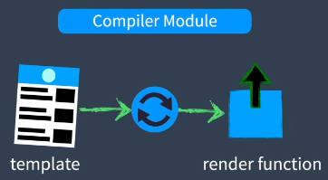
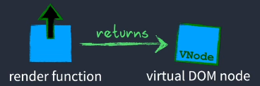

# Vue3原理学习

本篇笔记默认已经学习完Vue2的原理，会省略相同的内容，建议先阅读Vue2原理笔记。

本篇笔记学习，参考自尤雨溪课程[`Deep Dive`](https://www.bilibili.com/video/BV1rC4y187Vw?spm_id_from=333.788.player.switch&vd_source=6eb095cb0562513bfc69ebc6ae07e057&p=2)

## 目录

1. 渲染函数

## 基础前置知识

Vue3使用TypeScript进行了完全的重写。

### 1.三大核心模块

1. **Reactivity Module**

   可创建JS响应式对象，这个对象会被监听变化。

   如果状态发送变化，会重新生成一个新的Virtual DOM，然后与旧的做对比后，只修改变化的部分。

2. **Compiler Module**

   

   将HTML模板转译成一个render函数，该函数返回Virtual DOM。

   这个行为可能会在运行时在浏览器中发送，但更可能在构建Vue项目时出现，这样浏览器就可以只接收渲染函数了。

3. **Renderer Module**

   它有三个不同的阶段：

   1. Render Phase

      

   2. Mount Phase

      

   3. Patch Phase

      

### 2.三大核心模块是如何配合工作的？

1. 首先`Compiler Module`将`template模板`编译成renderer函数，`Reactivity Module`则初始化响应式对象；

2. 接着`Renderer Module`在`Render Phase`中，使用renderer函数生成一个虚拟DOM；

   注意：这个渲染函数是引用了响应式对象的，监听响应式对象的变化，发生变化时会触发渲染函数执行

3. 在`Mount Phase`将虚拟DOM转译成真实DOM，并挂载到容器中；

4. 之后，当`Reactivity Module`监听到响应式对象发生变化，就到了`Renderer Module`的`Patch Phase`，使用渲染函数生成一个新的虚拟DOM；

5. 新旧虚拟DOM都会传给`patch函数`进行比对，然后根据需要更新变化的部分。
