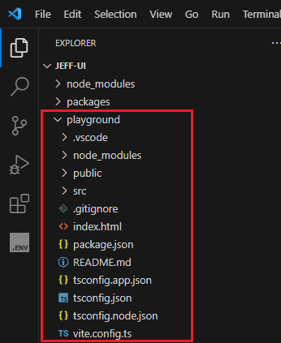
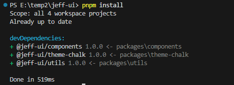
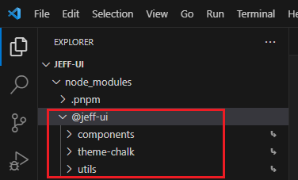

# 基本目录结构搭建


## 1.创建项目

首先，我们需要创建`jeff-ui`作为项目根目录，并初始化`pnpm`

```sh
mkdir jeff-ui
cd jeff-ui
pnpm init
```


创建成功后，简单调整一下`package.json`

```json
{
  "name": "jeff-ui",
  "version": "1.0.0",
  "description": "组件库",
  "scripts": {},
  "author": "jeffrey",
  "license": "MIT"
}
```


## 2.子包 packages

我们会把组件库的核心代码都放在`packages`目录下，里面会包含`组件：components`、`工具：utils`、`样式：theme-chalk`等等的子包。

在根目录下，把核心代码包里面存放的一些子包都一一创建好，并初始化pnpm

```sh
mkdir packages # 组件库的核心代码

# 进入核心包，开始创建相关的目录结构
cd packages
mkdir components # 组件
mkdir utils # 公共工具
mkdir theme-chalk # 主题样式

# 每个包都是一个单独的pnpm项目，所以需要挨个初始化
cd components
pnpm init

cd ../utils
pnpm init

cd ../theme-chalk
pnpm init
```


<p align="center"><b>创建完成后的目录结构</b></p>

<br />

修改每个包的`package.json`的`name`，将他们设置为`jeff-ui`的子包。

以`./packages/components/package.json`为例：

```json{2}
{
  "name": "@jeff-ui/components", // 主要修改这里，加上@jeff-ui前缀
  "version": "1.0.0",
  "private": true,
  "description": "",
  "main": "index.js",
  "scripts": {},
  "license": "MIT"
}

```

其他几个子包都需要这么做！


## 3.应用包 playground

`playground`是我们用来使用和测试我们所完成的组件的地方，相当于一个演示厅。

我们可以直接使用`vue-ts`模板来创建项目：

```sh
# 在项目根目录下执行
pnpm create vite@latest playground --template vue-ts

# 安装依赖
cd playground
pnpm install
```



> 记得把`playground`的`package.json`中的name也修改为子包
>
> ```json
> {
>   "name": "@jeff-ui/playground"
> }
> ```
>
> 


另外，为了不要每次运行都进入`playground`包才能运行，可以直接在根目录下的`package.json`配置一个启动脚本，方便直接启动项目。

```json{6}
{
  "name": "jeff-ui",
  "version": "1.0.0",
  "description": "组件库",
  "scripts": {
    "dev": "pnpm -C playground dev"
  },
  "author": "jeffrey",
  "license": "MIT",
  "devDependencies": {
    "@jeff-ui/components": "workspace: *",
    "@jeff-ui/theme-chalk": "workspace: *",
    "@jeff-ui/utils": "workspace: *"
  },
  "dependencies": {
    "vue": "^3.5.13"
  }
}
```


## 4.类型包 typing

创建一个`typing`目录，用来存放我们关于TS的一些声明文件。

```sh
mkdir typing
```


先预留着目录，不做其他处理。


在目录创建ts的配置文件`tsconfig.json`

```json
{
  "compilerOptions": {
      "module": "ESNext", // 指定打包模块类型为ESNext，紧跟现代JavaScript模块化规范
      "declaration": false, // 默认为不生成声明文件，减少不必要的文件输出
      "noImplicitAny": true, // 严禁未声明类型的变量，增强代码的类型安全性
      "removeComments": true, // 编译时自动删除注释，精简代码体积
      "moduleResolution": "node", // 按照Node.js的模块解析规则进行模块查找
      "esModuleInterop": true, // 支持ES6模块与CommonJS模块的互操作性
      "jsx": "preserve", // 保留JSX语法，方便在Vue组件中使用JSX进行视图编写
      "noLib": false, // 正常处理类库，确保项目依赖的各类库文件能被正确解析
      "target": "ES6", // 以ES6标准为目标编译代码，保证代码在主流环境中的兼容性
      "sourceMap": true, // 生成source - map文件，方便调试时定位原始代码位置
      "lib": [
          "ESNext",
          "DOM"
      ], // 指定编译时使用的库，涵盖最新的JavaScript特性与DOM相关功能
      "allowSyntheticDefaultImports": true, // 允许从没有默认导出的模块中进行默认导入
      "experimentalDecorators": true, // 启用装饰器特性，为代码编写提供更优雅的方式
      "forceConsistentCasingInFileNames": true, // 强制文件名大小写一致，避免因大小写问题导致的模块加载错误
      "resolveJsonModule": true, // 支持解析JSON模块，方便引入和使用JSON数据
      "strict": true, // 启用严格模式，全面提升代码的严谨性和可靠性
      "skipLibCheck": true // 跳过类库检测，加快编译速度
  },
  "exclude": [
      "node_modules",
      "**/__tests__",
      "dist/**"
  ]
}

```

> 直接配默认的也行，按自己需求改吧
>
> ```sh
> npx tsc --init
> ```


## 5.工作空间 pnpm-workspace

现在需要定义工作空间，把我们刚才创建的所有目录定义好，告诉pnpm，我们的工作空间涉及哪些包。

在根目录下创建`pnpm-workspace.yaml`

```yaml
packages:
  - 'packages/**/*'
  - 'playground'
  - 'typing'
```


## 6.pnpm配置文件

我们需要在pnpm配置文件中，配置`shamefully-hoist`为`true`，目的是为了解决子包在引用其他包时的依赖解析问题，把依赖提升到`node_modules`目录的顶层。

在根目录下创建`.npmrc`，

```
shamefully-hoist = true
```


## 7.安装子包

我们把组件库的核心包，统一安装到`node_modules`下，这样可以让子包能够互相引用暴露出来的变量、函数、组件，形成统一的工作空间。

先在根目录下的`package.json`中配置依赖

```json{9-11}
{
  "name": "jeff-ui",
  "version": "1.0.0",
  "description": "组件库",
  "scripts": {},
  "author": "jeffrey",
  "license": "MIT",
  "devDependencies": {
    "@jeff-ui/components": "workspace: *",
    "@jeff-ui/utils": "workspace: *",
    "@jeff-ui/theme-chalk": "workspace: *"
  }
}
```

接着直接在根目录执行安装命令

```sh
pnpm install
```






至此，我们组件库的基本项目目录结构，就已经基本成型了😆🎉🎉🎉。
