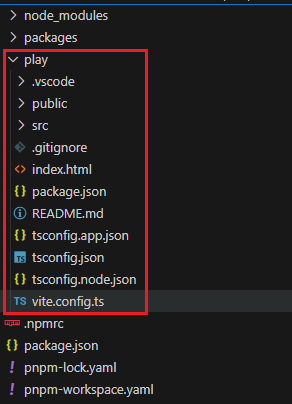
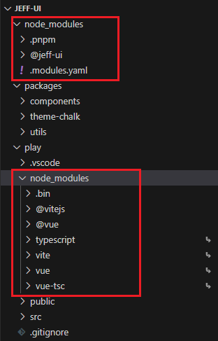
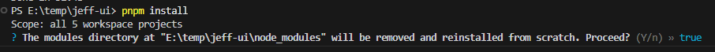
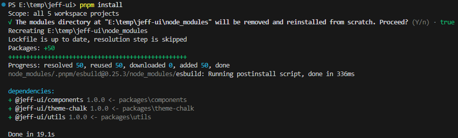
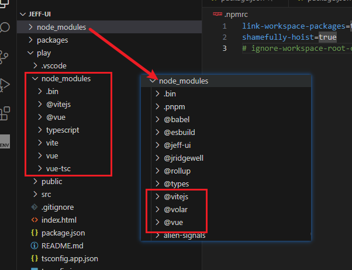

# 基本目录结构搭建


## 1.创建项目

首先，我们需要创建`jeff-ui`作为项目根目录，并初始化`pnpm`

```sh
mkdir jeff-ui
cd jeff-ui
pnpm init
```


创建成功后，简单调整一下`package.json`

```json
{
  "name": "jeff-ui",
  "version": "1.0.0",
  "description": "组件库",	// 补充描述
  "scripts": {},	// 把脚本先去掉
  "author": "jeffrey",	// 设置作者名称
  "license": "MIT" // 改为MIT协议
}
```


## 2.创建子包 packages

我们会把组件库的核心代码都放在`packages`目录下，里面会包含`组件：components`、`工具：utils`、`样式：theme-chalk`等等的子包。

在根目录下，把核心代码包里面存放的一些子包都一一创建好，并初始化pnpm

```sh
mkdir packages # 组件库的核心代码

# 进入核心包，开始创建相关的目录结构
cd packages
mkdir components # 组件
mkdir utils # 公共工具
mkdir theme-chalk # 主题样式

# 每个包都是一个单独的pnpm项目，所以需要挨个初始化
cd components
pnpm init

cd ../utils
pnpm init

cd ../theme-chalk
pnpm init
```


<p align="center"><b>创建完成后的目录结构</b></p>

<br />

修改每个包的`package.json`的`name`，将他们设置为`jeff-ui`的子包。

以`./packages/components/package.json`为例：

```json{2}
{
  "name": "@jeff-ui/components", // 主要修改这里，加上@jeff-ui前缀
  "version": "1.0.0",
  "private": true,
  "description": "",
  "main": "index.js",
  "scripts": {},
  "license": "MIT"
}

```

其他几个子包都需要这么做！（为后续在根目录下安装子包做准备）


子包创建好了，那么现在我们来尝试直接安装子包！

```sh
pnpm i @jeff-ui/components @jeff-ui/utils @jeff-ui/theme-chalk
```


出错了！可以看到它直接跑去镜像仓库去查找我们的子包下载了，这当然是没有的！

那么如何做才能让它从我们本地的仓库去下载呢？

这就得提到pnpm的工作空间Workspace了。


## 3.pnpm工作空间（Workspace）

> pnpm 内置了对单一存储库（也称为多包存储库、多项目存储库或单体存储库）的支持。你可以创建一个工作空间以将多个项目合并到一个仓库中。
>
> 一个工作空间必须在它的根目录有一个[`pnpm-workspace.yaml`](https://pnpm.io/zh/pnpm-workspace_yaml)文件。

> `pnpm-workspace.yaml` 定义了 [工作空间](https://pnpm.io/zh/workspaces) 的根目录，并能够使你从工作空间中包含/排除目录。 默认情况下，包含所有子目录的所有包。


我们在项目根目录下创建`pnpm-workspace.yaml`配置文件，然后再尝试安装，看看会发送什么

```yaml
packages:
  # packages/ 直接子目录中的所有包
  - 'packages/*'
```


可以看到pnpm给出了提示

1. 将依赖安装到工作空间的根目录下：在安装依赖的命令上加上`-w`指令
2. 如果不想加`-w`，直接安装，不要提示告警，就在根目录下创建配置`.npmrc`，然后加上配置`ignore-workspace-root-check=true`


我们直接给命令加上`-w`指令吧


还是有问题呀！查查文档....oh！还有一个关键配置`link-workspace-packages`

> If [linkWorkspacePackages](https://pnpm.io/zh/settings#linkWorkspacePackages) is set to `true`, pnpm will link packages from the workspace if the available packages match the declared ranges. 

### 3.1 link-workspace-packages

> ### [link-workspace-packages](https://pnpm.io/zh/npmrc#link-workspace-packages)
>
> - 默认值： **false**
> - 类型：**true**、**false**、**deep**
>
> 将 monorepo 工作空间中本地可用的包链接到 `node_modules`，而不是从注册源中重新下载它们。 这模拟了类似于 `yarn workspace` 的功能 。
>
> 当设置为 deep 时，本地包也可以链接到子依赖项。
>
> Be advised that it is encouraged instead to use [`pnpm-workspace.yaml`](https://pnpm.io/zh/next/settings#linkWorkspacePackages) for this setting, to enforce the same behaviour in all environments. （这句话在中文文档没有翻译，大意就是建议开发者应配合使用 pnpm-workspace.yaml 来配置工作区相关的设置，以确保无论在哪个环境下运行，pnpm 的行为都是相同和稳定的。这样做可以减少因为环境差异带来的潜在问题，增强项目的可维护性和一致性。）

我们在根目录下创建一个`.npmrc`

```sh
link-workspace-packages=true
```

然后再执行一次依赖安装


终于成功啦！可以看到根目录下的`node_modules`现在包含了`@jeff-ui`相关的子包


`package.json`的依赖使用的是`workspace`协议


> 如果没有使用此文件进行`packages`的配置，在配置了`shamefully-hoist=true`，且`package.json`里面已经有一个工作空间内的依赖包（`"dependencies": {"@jeff-ui/components": "workspace:^"}`）的前提下，当我们在根目录执行`pnpm install -w`时，pnpm会自动检索整个项目目录中，所有包含package.json的包，并直接全部下载到根目录的`node_modules`中。
>
> 比如我们在根目录创建了一个testxxx目录，并且在testxxx目录中执行了初始化`pnpm init`，那么在安装依赖时，该包也会被链接安装到`node_modules`中，然而我们并不需要它被安装！


### 3.2 shamefully-hoist

这个配置我们也提前配置好，后面会用到

> ### [shamefully-hoist](https://pnpm.io/zh/npmrc#shamefully-hoist)
>
> - 默认值： **false**
> - 类型：**Boolean**
>
> 默认情况下，pnpm 创建一个半严格的 `node_modules`，这意味着依赖项可以访问未声明的依赖项，但 `node_modules` 之外的模块不行。 通过这种布局，生态系统中的大多数的包都可以正常工作。 但是，如果某些工具仅在提升的依赖项位于根目录的 `node_modules` 时才有效，你可以将其设置为 `true` 来提升它们。

我们在`.npmrc`中加上这条配置

```sh{2}
link-workspace-packages = true
shamefully-hoist = true
```

做了这一步配置之后，项目内所有安装的依赖包，都会被提升到根目录下的`node_modules`，之后只要有安装过的依赖，在项目内的任何位置都能引入使用，不会出现查找不到的情况。

举个例子，如果我们在根目录下载一个vue脚手架模版`pnpm create vite@latest xxxdir123 --template vue`，在没有将`shamefully-hoist`设置为`true`的时候，进入目录执行`pnpm install`去下载依赖，这些依赖就只会被下载到`xxxdir123`这个包里面的`node_modules`中。但如果做了设置，这些依赖不仅会被下载到该目录下，还会被提升到根目录下的`node_modules`中。这样的好处在于，之后在整个工作目录下，所有子包之间，都可以相互使用各自暴露出来的内容了。


## 4.应用包 playground

`playground`是我们用来使用和测试我们所完成的组件的地方，相当于一个演示厅。

我们可以直接使用`vue-ts`模板来创建项目：

```sh
# 在项目根目录下执行
pnpm create vite@latest play --template vue-ts
```



> 记得把`playground`的`package.json`中的name也修改为子包
>
> ```json
> {
>   "name": "@jeff-ui/playground"
> }
> ```
>

接下来准备安装一下依赖，然后尝试运行。

先在`pnpm-workspace.yaml`中新增“play”包的定义，这样当我们在根目录执行`pnpm install`安装依赖时，就会去查找指定好的子包，并根据子包的`package.json`进行依赖安装。

```yaml{4}
packages:
  # packages/ 直接子目录中的所有包
  - 'packages/*'
  - 'play' # 新增子包
```

接着在根目录下执行依赖安装的命令

```sh
jeffrey@jeffrey-macbook jeff-ui % pnpm install
# 以下是输出内容
Scope: all 4 workspace projects # 检测到有4个工作空间项目（其中一个就是我们定义的playground包
Packages: +31
+++++++++++++++++++++++++++++++
Progress: resolved 74, reused 31, downloaded 0, added 31, done
Done in 2.2s
```

安装好依赖了，仔细观察，依赖目前是安装到了play包下面了。



如果仅仅只是play包运行当然问题不大，但是我们之后要开始在其他包编写vue组件，也需要用到vue框架、ts等依赖，难道又要重新下载一次？这就显得麻烦且臃肿了，而且不同包使用的工具还会出现版本不同的兼容问题。

所以合理一点的方案应该是把所有的依赖都下载到根目录下的`node_modules`中，这样所有子包在任何位置都可以直接引入下载过的依赖了。

通过设置配置项`shamefully-hoist`为`true`，即可实现。

### 4.1 shamefully-hoist

> ### [shamefully-hoist](https://pnpm.io/zh/npmrc#shamefully-hoist)
>
> - 默认值： **false**
> - 类型：**Boolean**
>
> 默认情况下，pnpm 创建一个半严格的 `node_modules`，这意味着依赖项可以访问未声明的依赖项，但 `node_modules` 之外的模块不行。 通过这种布局，生态系统中的大多数的包都可以正常工作。 但是，如果某些工具仅在提升的依赖项位于根目录的 `node_modules` 时才有效，你可以将其设置为 `true` 来提升它们。

我们在`.npmrc`中加上这条配置

```sh{2}
link-workspace-packages = true
shamefully-hoist = true
```

做了这一步配置之后，项目内所有安装的依赖包，都会被提升到根目录下的`node_modules`，之后只要有安装过的依赖，在项目内的任何位置都能引入使用，不会出现查找不到的情况。


加好配置以后，让我们再次尝试依赖安装：

```sh
pnpm install
```



提示我们根目录下的`node_modules`会被移除重装，回车确认即可。





可以看到根目录下的`node_modules`新增了很多依赖包了。

接下来尝试运行一下`play`包的vue项目吧，我们可以直接进入到`play`包然后执行`pnpm dev`，但这样显得有点麻烦。

为了不要每次运行都进入`play`包才能运行，可以直接在根目录下的`package.json`配置一个启动脚本，方便直接启动项目。

```json{6}
{
  "name": "jeff-ui",
  "version": "1.0.0",
  "description": "组件库",
  "scripts": {
    "dev": "pnpm -C playground dev"
  },
  "author": "jeffrey",
  "license": "MIT",
  "devDependencies": {
    "@jeff-ui/components": "workspace: *",
    "@jeff-ui/theme-chalk": "workspace: *",
    "@jeff-ui/utils": "workspace: *"
  },
  "dependencies": {
    "vue": "^3.5.13"
  }
}
```

直接在根目录下运行：

```sh
pnpm dev
```


跑起来了！之后写好的组件，都可以尝试直接在这里引入，进行组件使用和测试啦！


## 5.类型包 typing

创建一个`typing`目录，用来存放我们关于TS的一些声明文件。

```sh
mkdir typing
```


先预留着目录，不做其他处理。


在项目根目录创建ts的配置文件`tsconfig.json`

```json
{
  "compilerOptions": {
      "module": "ESNext", // 指定打包模块类型为ESNext，紧跟现代JavaScript模块化规范
      "declaration": false, // 默认为不生成声明文件，减少不必要的文件输出
      "noImplicitAny": true, // 严禁未声明类型的变量，增强代码的类型安全性
      "removeComments": true, // 编译时自动删除注释，精简代码体积
      "moduleResolution": "node", // 按照Node.js的模块解析规则进行模块查找
      "esModuleInterop": true, // 支持ES6模块与CommonJS模块的互操作性
      "jsx": "preserve", // 保留JSX语法，方便在Vue组件中使用JSX进行视图编写
      "noLib": false, // 正常处理类库，确保项目依赖的各类库文件能被正确解析
      "target": "ES6", // 以ES6标准为目标编译代码，保证代码在主流环境中的兼容性
      "sourceMap": true, // 生成source - map文件，方便调试时定位原始代码位置
      "lib": [
          "ESNext",
          "DOM"
      ], // 指定编译时使用的库，涵盖最新的JavaScript特性与DOM相关功能
      "allowSyntheticDefaultImports": true, // 允许从没有默认导出的模块中进行默认导入
      "experimentalDecorators": true, // 启用装饰器特性，为代码编写提供更优雅的方式
      "forceConsistentCasingInFileNames": true, // 强制文件名大小写一致，避免因大小写问题导致的模块加载错误
      "resolveJsonModule": true, // 支持解析JSON模块，方便引入和使用JSON数据
      "strict": true, // 启用严格模式，全面提升代码的严谨性和可靠性
      "skipLibCheck": true // 跳过类库检测，加快编译速度
  },
  "exclude": [
      "node_modules",
      "**/__tests__",
      "dist/**"
  ]
}

```

> 直接配默认的也行，按自己需求改吧
>
> ```sh
> npx tsc --init
> ```


同样的，在`pnpm-workspace.yaml`中新增定义

```yaml{5}
packages:
  # packages/ 直接子目录中的所有包
  - 'packages/*'
  - 'playground'
  - 'typing' # 新增子包
```


至此，我们组件库的基本项目目录结构，就已经基本成型了😆🎉🎉🎉。
