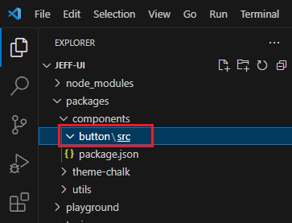
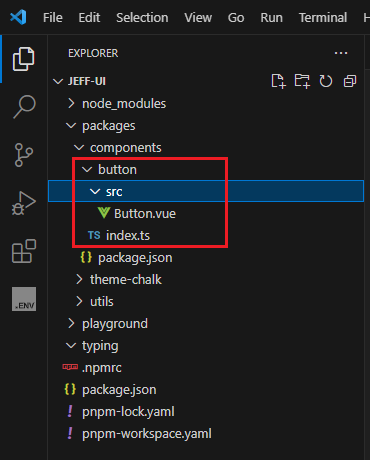
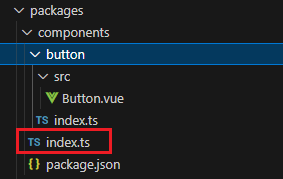
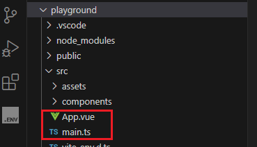
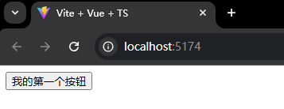

# 编写第一个组件


目前，我们的项目目录结构已经建成，现在我们来尝试编写一个`Button`组件，并在`playground`中尝试使用。


进入`components`目录

```sh
cd ./packages/components
mkdir button # 创建button目录，之后button相关的代码全部都写在这里

cd button
mkdir src # 编写源码的地方
```



在`src`下创建`Button.vue`组件

```vue
<template>
  <div>
    <button>
      <slot>按钮</slot>
    </button>
  </div>
</template>

<script setup lang="ts">

defineOptions({
  name: 'JeButton' // 设定组件名称，后续运用该名称使用组件。
})

</script>
```

然后在`button`目录下创建一个`index.ts`用于将组件暴露出去。

```ts
import type { App } from 'vue'
import Button from './src/Button.vue'

// 按照Vue的要求，以插件形式提供给用户进行组件安装
Button.install = (app: App) => {
  app.component(Button.name!, Button)
}

// 支持按需引入
export const JeButton = Button

export default JeButton
```



> 补充：这里使用到了vue依赖，如果按照前面的步骤已经先把playground包的依赖安装好了，就不需要再另外安装vue了。如果前面还没安装，就需要切换到根目录下安装一下
>
> ```sh
> pnpm add vue -w
> ```

<br />


接着，我们在`components`目录下创建一个`index.ts`，把我们所有的组件都一一暴露出去。



```typescript
// components/index.ts
export * from './button'
```


组件编写好了，我们来尝试在`playground`中使用它。

进入playground包，改写`main.ts`和`App.vue`



`main.ts`

```ts{4,7}
import { createApp } from 'vue'
import App from './App.vue'

import { JeButton } from '@jeff-ui/components/button'

const app = createApp(App)
app.use(JeButton) // 传入时可能会有TS报错，没关系，我们后面再来解决
app.mount('#app')
```

`App.vue`

```vue
<template>
  <JeButton>我的第一个按钮</JeButton>
</template>

<script setup lang="ts"></script>
```



成功！✌️