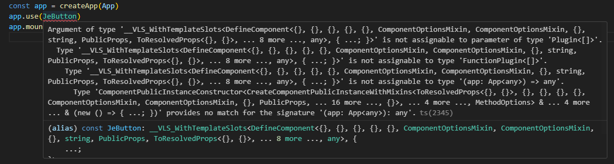
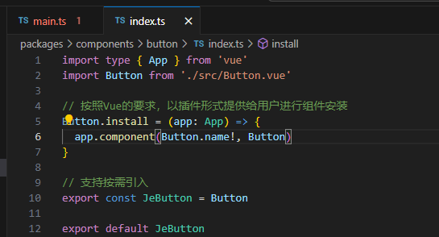
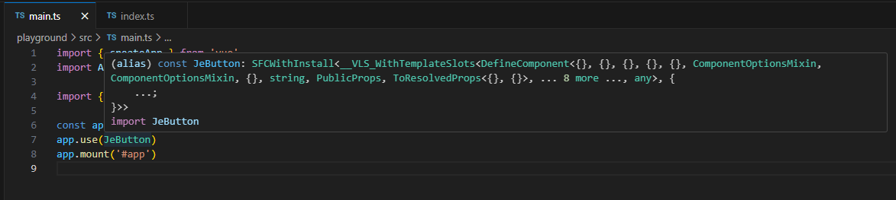
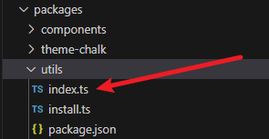
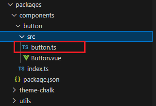
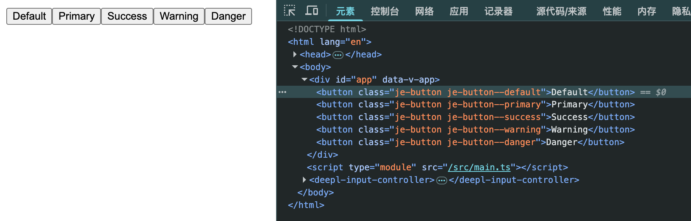

# 进一步优化Button组件

## 1.解决TS报错问题

上一节遗留了一个小问题



虽然最终组件可以成功使用，但是这里产生了一个TS错误。

原因在于我们传入的这个组件的类型，并不是`Plugin`，需要我们做类型转换。


让我们回到`./packages/components/button/index.ts`



我们可以创建一个`withInstall`函数，用来包装类型。另外，注册组件的工作，也一并放到里面去。

```ts{4-9,11}
import type { App } from 'vue'
import Button from './src/Button.vue'

const withInstall = <T>(comp: T) => {
    comp.install = (app: App) => {
        app.component(comp.name, comp)
    }
    return comp
}

export const JeButton = withInstall(Button)

export default JeButton
```

接着引入`vue`提供的`Plugin`类型，在函数中转换`comp`

```ts{2,8,12-16}
import type {
  Plugin,
  App
} from 'vue'
import Button from './src/Button.vue'

// 定义一个联合类型
type SFCWithInstall<T> = T & Plugin

const withInstall = <T>(comp: T) => {

  const compWithInstall = comp as SFCWithInstall<T>
  compWithInstall.install = (app: App) => {
    app.component((comp as any).name,  compWithInstall)
  }
  
  return compWithInstall
}

export const JeButton = withInstall(Button)

export default JeButton

```

回到`playground`，看我们之前注册的`Button`组件



可以看到，现在类型已经符合要求了。


## 2.抽离公共代码

这个`withInstall`函数，会在后续每一个组件的创建都用到，所以我们可以将它抽离出来，放到公共工具包`@jeff-ui/utils`中。

在`@jeff-ui/utils`中创建`install.ts`，把刚才的`withInstall`函数相关的代码放在这里，并暴露出去

```ts{6}
import type { App, Plugin } from 'vue'

// 定义一个联合类型
type SFCWithInstall<T> = T & Plugin

export const withInstall = <T>(comp: T) => {
  (comp as SFCWithInstall<T>).install = (app: App) => {
    app.component((comp as any).name, comp as SFCWithInstall<T>)
  }
  return comp as SFCWithInstall<T>
}
```

接着，再创建一个`index.ts`，用于统一将所以工具函数暴露出去。



```ts
// utils/index.ts
export * from './install'
```

然后回到我们的`Button.vue`组件代码，直接引入`withInstall`使用即可。

```ts
import Button from './src/Button.vue'
import { withInstall } from '@jeff-ui/utils'

export const JeButton = withInstall(Button)

export default JeButton
```

代码简洁了不少~☺️


## 3.补充props

组件需要接收属性参数，才能做到可配置。

我们在`button/src/button.ts`中编写组件相关的props、公共方法等。



```ts
// 组件可选类型
export const buttonTypes = [
  '',
  'default',
  'primary',
  'success',
  'warning',
  'danger',
  'info',
] as const

export const buttonProps = {
  type: {
    type: String,
    values: buttonTypes,
    default: ''
  }
}
```


在`Button.vue`中引入并设置：

```vue
<template>
  <button
    :className="className">
    <slot>按钮</slot>
  </button>
</template>

<script setup lang="ts">
import { computed } from 'vue'
import { buttonProps } from './button'

defineOptions({
  name: 'JeButton'
})

const props = defineProps(buttonProps)

const className = computed(() => {
  const buttonType = props.type

  return `je-button je-button--${buttonType}`

})

</script>
```

现在，我们尝试在`playground`中设置属性，看看是否可以生效。

```vue
<!-- App.vue -->
<template>
  <JeButton type="default">Default</JeButton>  
  <JeButton type="primary">Primary</JeButton>  
  <JeButton type="success">Success</JeButton>  
  <JeButton type="warning">Warning</JeButton>  
  <JeButton type="danger">Danger</JeButton>  
</template>
```




## 4.补充样式

现在已经成功设置好了className，那么只要把样式补充好，我们就可以得到一个毕竟像样的按钮组件啦！

样式的设置，我们在`theme-chalk`中进行，这样有助于我们之后进行主题样式切换的开发。


我们将采用`sass`来完成样式编写。

```sh
# 切换至项目根目录，执行依赖安装
pnpm add sass -w -D
```


首先我们需要给我们的组件定义一个命名空间作为所有className的前缀（例如je-xxxx）

进入`packages/theme-chalk`，创建config.scss

```scss
// 定义“命名空间”变量
$namespace: 'je';
```


