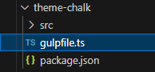
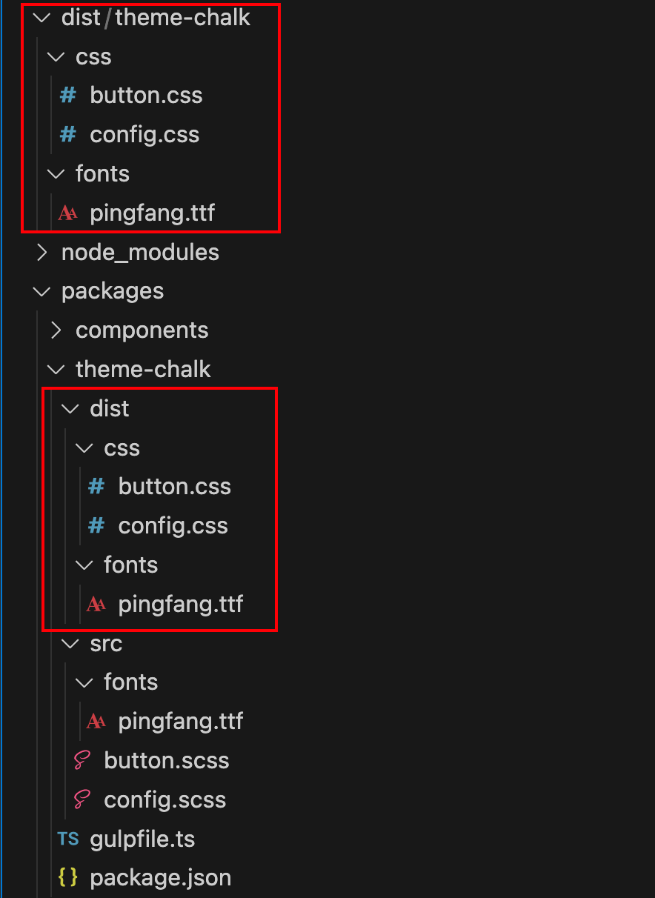

# 组件打包

上一节，我们已经有一个比较像样的按钮组件了，本节我们开始尝试将组件库打包成一个可让外部引入的库。

打包涉及样式、工具、Vue等不同内容，我们需要使用相应的一些打包工具，对这些内容进行打包整合。

我们将采用`Gulp`来进行任务流程控制，可以定制我们的打包工作的流程


## 一、引入Gulp

先做准备工作，安装相关依赖

```ts
pnpm install gulp @types/gulp sucrase -D -w
```

- gulp: gulp工具
- @types/gulp: gulp工具对应的类型文件
- sucrase：让gulp支持ts，可以用更快的方式转译 TypeScript 或 JSX，尤其适合在开发阶段缩短构建时间。


在根目录创建一个build文件夹，用于专门处理打包相关的内容

同时创建一个`gulpfile.ts`文件，我们的任务流就往这里写


编写任务：

```typescript
import { series } from 'gulp'

export default series(
	async () => console.log('开始打包！'),
	async () => console.log('打包中....'),
	async () => console.log('开始结束！')
)
```

series会串行执行任务，传入“任务”会按顺序依次执行，需要使用`async`声明。

（还有另外一个用于执行并行任务的方法`parallel`，我们后面会用到）


可以看到，在执行开始的时候，使用到了`sucrase`，用来处理ts；然后进入build目录，使用gulpfile文件。

最先执行`default`任务，然后依次执行我们的匿名任务。


接下来让我们给每个子任务起名字，以便我们在控制台可以看到整个打包流程的任务执行情况。

可以给函数设置`displayName`属性，gulp在执行时，就可以输出任务名了。

```typescript
import { series } from 'gulp'

const withTaskName = (name: string, func: any) => Object.assign(func, { displayName: name })

const compileTS = async () => {
  console.log('runing....complete')
}
const compressCode = async () => {
  console.log('runing....complete')
}
const outputProject = async () => {
  console.log('runing....complete')
}

export default series(
 withTaskName('编译TypeScript文件', compileTS),
 withTaskName('压缩代码', compressCode),
 withTaskName('整合所有目录', outputProject)
)
```


把`withTaskName`方法放到utils包里面吧，之后其他模块也可以共享该方法了。


`utils/index.ts`

```typescript
export const withTaskName = (name: string, func: any) => Object.assign(func, { displayName: name })
```

`gulpfile.ts`

```typescript{2}
import { series } from 'gulp'
import { withTaskName } from './utils'
const compileTS = async () => {
  console.log('runing....complete')
}
const compressCode = async () => {
  console.log('runing....complete')
}
const outputProject = async () => {
  console.log('runing....complete')
}

export default series(
 withTaskName('编译TypeScript文件', compileTS),
 withTaskName('压缩代码', compressCode),
 withTaskName('整合所有目录', outputProject)
)
```


## 二、执行脚本

我们需要有执行shell脚本的能力，这样才能支持我们比如删除旧的dist目录、执行pnpm build之类的功能。

`utils/index.ts`

```typescript
import { spawn } from 'child_process'
import path from 'path'

// 给gulp任务设置任务名称
export const withTaskName = (name: string, func: any) => Object.assign(func, { displayName: name })

// 执行shell脚本
export const runCMD = async (command: string) => {
  return new Promise((resolve, reject) => {
    const [cmd, ...args] = command.split(' ')	// 使用空格分割命令和参数
    const projectRoot = path.resolve(__dirname, '../../')	// 定义根目录路径
    const app = spawn(cmd, args, {
      cwd: projectRoot,
      stdio: 'inherit',
      shell: true
    })
    app.on('close', resolve)
  })
}
```

通过引入`child_process`的`spawn`方法，可以实现shell脚本的执行


接下来我们来尝试使用`runCMD`来执行我们的脚本

```typescript
// gulpfile.ts
import { series } from 'gulp'
import { withTaskName, runCMD } from './utils'

export default series(
	withTaskName('remove dist', () => runCMD('rm -rf ./dist'))
)
```

先在根目录创建一个`dist`目录，然后执行`pnpm build`，结果应该是`dist`被成功删除！


## 三、打包前的准备工作

接下来，我们就要开始进行打包的工作了，我们会需要打包`组件样式`、`组件`、`工具`等，在此之前先做好准备工作。

新增一个任务，用于自动检测`packages`包下所有包含`build`脚本的包，并执行它

```typescript{7}
// gulpfile.ts
import { series } from 'gulp'
import { withTaskName, runCMD } from './utils'

export default series(
	withTaskName('remove dist', () => runCMD('rm -rf ./dist')),
  withTaskName('build packges', () => runCMD('pnpm run --filter ./packages/* --parallel build'))
)
```

- `--filter`：将命令限制为包的特定子集，这里相当于让改命令限制在`./packages`包下的所有子包中
- `--parallel`：完全无视并发性和拓扑排序，立即在所有具有前缀流输出的匹配包中运行给定的脚本。这是许多包上长时间运行的进程的首选标志，例如，漫长的构建过程。


可以看到，检测到三个包，但是没有一个包是包含“build”脚本的，所以接下来需要我们到每一个子包下，单独配置子包自己的打包任务。

> 注意：`pnpm run --filter ./packages/* --parallel build`命令是针对pnpm版本大于`10.x`的，如果版本比这个低，路径应该写成`./packages`

## 四、打包样式

打包样式需要做的事情，主要有：

1. 将Sass编译成CSS
2. 补充CSS兼容性前缀
3. 压缩CSS文件
4. 将打包好的文件，拷贝到根目录下的dist目录中


<p align="center">目录结构</p>

安装打包样式所需要的依赖

```sh
pnpm i gulp-sass gulp-autoprefixer gulp-clean-css -D -w
```

- gulp-sass:sass编译css

- gulp-autoprefixer:自动添加兼容性前缀
- gulp-clean-css：压缩样式文件

安装相应的类型文件

```sh
pnpm i @types/gulp-sass @types/sass @types/gulp-autoprefixer @types/gulp-clean-css -D -w
```


在`theme-chalk`下的`package.json`中新增脚本命令

```json{7}
{
  "name": "@jeff-ui/theme-chalk",
  "version": "1.0.0",
  "description": "",
  "main": "index.js",
  "scripts": {
    "build": "gulp"
  },
  "keywords": [],
  "author": "",
  "license": "ISC"
}
```

创建`gulpfile.ts`文件



```typescript
// gulpfile.ts
import { dest, series, src } from 'gulp'
import path from 'path'
import Sass from 'sass'
import GulpSass from 'gulp-sass'
import GulpAutoprefixer from 'gulp-autoprefixer'
import GulpCleanCSS from 'gulp-clean-css'
import { runCMD } from '../../build/utils'

// 删除原打包文件
async function removeDist() {
  runCMD('rm -rf ./packages/theme-chalk/dist')
}

// 编译（编译、补充兼容性前缀、压缩）
function compile() {
  const sass = GulpSass(Sass)
  return src(path.resolve(__dirname, './src/css/*.scss'))
    .pipe(sass.sync())
    .pipe(GulpAutoprefixer())
    .pipe(GulpCleanCSS())
    .pipe(dest(path.resolve(__dirname, './dist/css')))
}

// 将字体文件拷贝到dist目录中
function copyFontsFile() {
  return src(path.resolve(__dirname, './src/fonts/*'))
    .pipe(dest(path.resolve(__dirname, './dist/fonts')))

}

// 将打包好的文件拷贝到根目录的dist包中
function copyAllStyleFile() {
  return src(path.resolve(__dirname, './dist/**'))
    .pipe(dest(path.resolve(__dirname, '../../dist/theme-chalk')))
}

export default series(
  removeDist,
  compile,
  copyFontsFile,
  copyAllStyleFile
)


```




## 打包TS

对于ts文件，在各种各种的包里面都有可能涉及（例如utils、hooks等），所以我们应该把打包的逻辑抽离到一个公共的地方，之后只要涉及ts文件的打包编译，都可以直接从这个地方引用。

我们在`/build/utils`目录下，创建一个`packages.ts`文件

```typescript
export const buildPackages = (path: string, name: string) => {
	console.log(path, '======', name)
	return async () => {
    
  }
}
```

接着我们在`packages/utils/gulpfile.ts`进行引入使用。

```typescript
import { buildPackages } from '../../build/packages.ts'


export default buildPackages(__dirname, 'utils')
```

在`packages/utils`下执行`pnpm build`


为了让我们的工具同时支持CommonJS和ESM，我们需要定义一个配置文件，可以针对不同的模块类型，获得不同的打包配置。

`/build/utils/config.ts`

```typescript
import { outDir } from "./path"
import path from 'path'

export const buildConfig = {
  esm: {
    module: 'ESNext',   // tsconfig输出的结果
    format: 'esm',      // 格式化后的模块规范
    output: {
      name: 'es',       // 输出后的文件夹名
      path: path.resolve(outDir, 'es')  // 输出路径
    },
    bundle: {
      path: 'jeff-ui/es'
    }
  },
  cjs: {
    module: 'CommonJS',
    format: 'cjs',
    output: {
      name: 'lib',
      path: path.resolve(outDir, 'lib')
    },
    bundle: {
      path: 'jeff-ui/lib'
    }
  }
}

export type BuildConfig = typeof buildConfig
```

路径`/build/utils/paths`

```typescript
import path from 'path'

// 项目根路径
export const projectRoot = path.resolve(__dirname, '../../')
// 项目最终打包路径
export const outDir = path.resolve(__dirname, '../../dist')
```

然后我们在`build/utils/packages.ts`中获取配置，为每一个配置生成各自的打包编译任务。

在编写之前，我们需要安装一个新的依赖`gulp-typescript`用来支持我们对ts文件进行编译打包。

```sh
pnpm add gulp-typescript -w -D
```

安装好之后，我们开始写任务内容：

```ts
import { series, parallel, src, dest } from 'gulp'
import { buildConfig } from './config'
import path from 'path'
import { projectRoot } from './paths'
import ts from 'gulp-typescript'

export const buildPackages = (dirname: string, name: string) => {

  const tasks = Object.entries(buildConfig).map(([moduleName, config]) => {
    // ts配置文件的路径，后面使用gulp-typescript的时候需要用到
    const tsConfigPath = path.resolve(projectRoot, 'tsconfig.json')
    // 最终输出的目录地址（就是该函数得到的传参dirname）
    const outputPath = path.resolve(dirname, config.output.name)
    // 包含的文件范围
    const inputs = ['**/*.ts', '!gulpfile.ts', '!node_modules']
    
    // 创建一个tsProject
    const tsProject = ts.createProject(tsConfigPath, {
      declaration: true,	// 需要生成配置文件
      strict: false,			// 关闭【严格模式】主要是为了不要产生那么多报错信息，影响我们学习
      module: config.module	// 输出的模块类型
    })
    
    // 返回一个串行任务
    return series(
    	async () => src(inputs)
      	.pipe(tsProject())
      	.pipe(dest(outputPath)),
      async () => {
        const from = `${output}/**`
        const to = path.resolve(outDir, config.output.name, packageName)
        return src(from).pipe(dest(to))
      }
    )
    
  })
  
  // 将所有串行任务，以并行的形式返回
  return parallel(...tasks)
}
```


## 打包Vue


## Rollup

将多个模块编译打包整合

